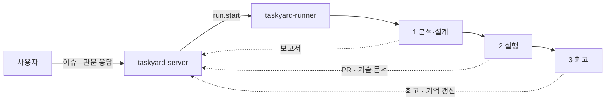
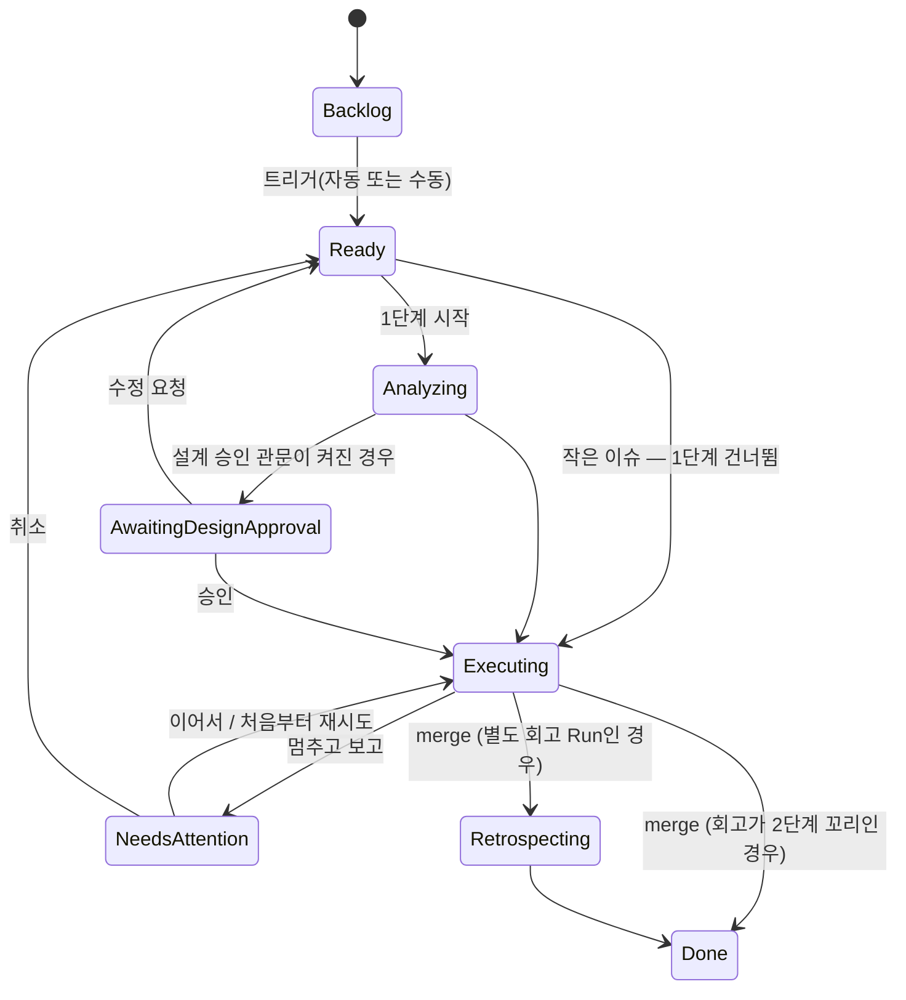
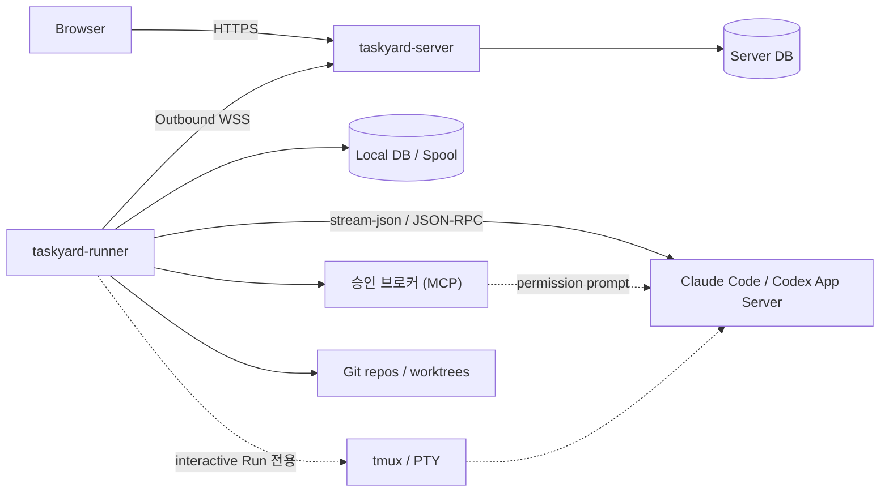

# Taskyard 제품 요구사항 문서(PRD)

> **제품 한 줄 정의:** 이슈마다 정해진 절차(분석·설계 → 실행 → 회고)를 코딩 에이전트에게 배정하고 관제하는, 여러 프로젝트를 운영하는 1인 개발자용 시스템
>
> **태그라인:** Run your coding agents like a team.

| 항목 | 내용 |
|---|---|
| 문서 버전 | v1.2 Draft |
| 작성일 | 2026-08-21 |
| 최종 수정 | 2026-09-02 — v1.2 (조직 층 제거, 이슈별 3단계 파이프라인으로 실행 모델 재정의) |
| 1차 대상 | 여러 소프트웨어 프로젝트를 동시에 운영하는 1인 개발자 |
| 제품 형태 | 자체 호스팅 웹 서버 + 사용자 머신의 실행 러너 |
| 구현 언어 | Go 중심 |
| 핵심 제약 | 모델 API 비용 대신 사용자가 직접 로그인한 공식 Claude/Codex CLI 구독 사용 |
| 협업 기능 | MVP 제외, 다음 단계 |

---

## 0. 변경 요약

### v1.2 (2026-09-02)

Phase 0 스파이크(§16.0)를 마친 뒤 미션을 다시 점검했다. v1.1의 실행 모델은 "AI 개발 조직"(Planner·Worker·Coordinator·Integrator)이었고, 그 조직이 만드는 복잡성 — 충돌 통합, 질문 중재, 조직 기억 — 이 PRD에서 가장 덜 정의된 부분이었다. v1.2는 조직 층을 걷어내고, **이슈 하나에 에이전트 하나가 정해진 절차를 끝까지 수행하는 파이프라인**으로 실행 모델을 바꾼다. 절차의 내용은 프로젝트의 프롬프트 템플릿이 정하고, Taskyard는 단계·관문·산출물·알림만 책임진다. 절 번호는 v1.1과 같게 유지했다 — 코드와 문서가 절 번호로 이 문서를 참조하기 때문이다. 내용이 없어진 절은 그 자리에 한 줄로 남겼다.

| # | 변경 | 위치 |
|---|---|---|
| 1 | Planner·Worker·Coordinator·Integrator 조직 층 제거. 이슈 하나는 에이전트 하나가 끝까지 맡는다 | §3, §6, §7 |
| 2 | 실행 모델을 이슈별 3단계 파이프라인(분석·설계 → 실행 → 회고)으로 재정의. 1단계는 작은 이슈에서 건너뛰고, 3단계 기본값은 2단계의 꼬리 | §7.2 |
| 3 | 이슈 내 병렬(Worker 분할 + Integrator 통합) 제거. 큰 이슈는 1단계가 하위 이슈로 쪼개고, 병렬은 이슈 간에만 | §7.3, §7.4, §8.5 |
| 4 | Run 종료 방식 5종(merge / 멈추고 보고 / 취소 / 이어서 재시도 / 처음부터 재시도)과 재시도 시 세션 정책 | §7.6, §9.3 |
| 5 | worktree 정책 조정: merge되지 않은 worktree의 자동 삭제 금지는 유지, merge 확인 후 삭제는 프로젝트 정책(기본 삭제) | §8.7.1 |
| 6 | 단계 템플릿·트리거·산출물 요구사항 신설(ST-). Coordinator 요구사항(CO-)을 프로젝트 기억(ME-)으로 축소 | §8.3, §8.4 |
| 7 | AI 대화 기반 명세화(SP-)를 P0에서 P1로 — 미션 정의에 없다 | §8.2 |
| 8 | `exclusive_paths` 스케줄러 규칙을 이슈 간 P2로 | §7.4, §8.5 |
| 9 | Slack 웹훅 알림을 P1로, Run 상태에 `needs_attention` 추가 | §8.8, §9.3 |
| 10 | 데이터 모델에서 Plan·WorkItem·Dependency·CoordinatorMemory·Decision 제거, StageTemplate·Artifact 추가 | §12 |
| 11 | Phase 0 완료 표시, Phase 1 묶음 재편, 조직 층은 Phase 2 재검토 항목으로 | §16, §20 |
| 12 | 라이선스(FSL-1.1-ALv2)와 이름 유지 결정을 기록 | §21 |

### v1.1 (2026-08-21)

v1.0 검토에서 제기된 지적을 반영했다. Provider 자동화 표면은 공식 문서로 직접 검증했고(2026-08 기준), 검증 결과가 설계를 바꾼 부분은 해당 절에 근거와 함께 반영했다.

| # | 변경 | 위치 |
|---|---|---|
| 1 | Claude Code·Codex의 공식 자동화 표면을 검증하고 어댑터 설계를 사실 기반으로 다시 씀 | §11.6 |
| 2 | tmux를 실행 제어 경로에서 제외하고 사람의 탈출구로 강등. 웹 터미널의 의미를 재정의 | §8.6, §11.6.4, §11.6.5 |
| 3 | 두 Provider의 승인 흐름 비대칭을 명시하고 Runner에 로컬 승인 브로커 책임을 추가 | §11.3, §11.6.3 |
| 4 | "서버는 추론하지 않는다"의 대가(Runner 오프라인 시 AI 기능 전면 불가)를 트레이드오프로 명문화 | §11.2.1 |
| 5 | `--bare` 모드가 구독이 아닌 API 과금 경로라는 사실을 반영해 실행 플래그 금지 목록 신설 | §13.2.1 |
| 6 | 충돌 예측과 병렬 스케줄러의 연결을 데이터 모델과 요구사항으로 구체화 | §7.4, §8.5, §12 |
| 7 | worktree 미커밋 변경 보존을 P0 규칙으로 상세화 | §8.7.1 |
| 8 | `orphaned` Run 조정 절차를 알고리즘으로 기술 | §11.7 |
| 9 | Coordinator 기억 메커니즘을 별도 설계 문서 선행 항목으로 격상 | §8.4.1 |
| 10 | 웹 UI를 "HTMX 셸 + JS 아일랜드" 하이브리드로 확정 | §11.4.1 |
| 11 | 기존 P0 7묶음을 Phase 1로 재분류하고 실제 착수 범위인 Phase 0 수직 스파이크를 신설 | §16.0, §20 |
| 12 | 위험표·결정기록·출시 전 질문을 위 내용에 맞춰 갱신 | §19, §21, §22 |

---

## 1. 요약

Taskyard는 프로젝트별 티켓 보드를 중심으로, 이슈 하나하나를 정해진 절차에 따라 코딩 에이전트에게 배정하고 그 진행을 관제하는 개발 운영 도구다.

사용자는 이슈를 만든다. 프로젝트 설정에 따라 자동으로, 또는 사용자가 버튼을 눌러 파이프라인이 시작된다. 파이프라인은 세 단계 — **분석·설계 → 실행 → 회고** — 이며, 각 단계는 프로젝트에 미리 저장된 프롬프트 템플릿으로 에이전트를 새 세션에서 한 번 실행한다. 실행 단계는 브랜치와 PR을 만들고 정책에 따라 merge까지 간다. 에이전트가 스스로 끝낼 수 없으면 멈추고 이유와 함께 보고한다. 이슈 하나는 에이전트 하나가 끝까지 맡으며, 큰 이슈는 분석 단계가 하위 이슈로 쪼갠다.

Taskyard는 자체 티켓 관리기를 기본 시스템 오브 레코드로 사용한다. GitHub Issues, Jira, Linear는 티켓의 외부 원천 또는 연결 대상으로 취급하며, 사용자는 외부 서비스 없이도 전체 흐름을 사용할 수 있어야 한다.

실행은 두 개의 Go 바이너리로 분리한다.

- `taskyard-server`: 웹 UI, 티켓, 단계 템플릿, 정책, 동시 실행 관리, 실행 상태, 산출물, 알림 및 러너 관리를 담당한다.
- `taskyard-runner`: 사용자의 개발 머신에서 저장소, 공식 Claude/Codex CLI의 구조화 실행, 승인 브로커, Git worktree, 테스트 및 diff를 담당한다. tmux/PTY는 사용자가 직접 개입하는 대화형 세션에만 쓴다.

러너가 서버로 아웃바운드 연결하므로, 서버가 사용자의 소스코드나 Claude/Codex 인증정보를 직접 소유할 필요가 없다.

---

## 2. 문제 정의

### 2.1 사용자가 겪는 문제

여러 프로젝트를 운영하는 1인 개발자는 코딩 Agent를 사용할수록 직접 작성하는 코드의 양보다 다음 운영 비용이 커진다.

- 무엇을 먼저 시킬지 결정하고 맥락을 전달해야 한다.
- 큰 일을 독립적인 이슈로 나누고 순서를 정해야 한다.
- 여러 터미널과 tmux 세션을 오가며 질문, 승인, 실패를 확인해야 한다.
- 여러 이슈의 브랜치와 PR을 동시에 관리해야 한다.
- Agent가 끝났다고 보고한 결과가 실제 완료조건을 만족하는지 검증해야 한다.
- 여러 프로젝트의 실행 상태와 중요한 판단 요청을 한눈에 보기 어렵다.
- 모델 API를 직접 사용하면 비용이 커져, 이미 결제 중인 Claude/Codex 구독을 활용하고 싶다.

기존 도구들은 이 문제의 일부만 해결한다.

- Jira, Linear, Kaneo류는 티켓을 관리하지만 에이전트 실행과 그 결과를 책임지지 않는다.
- 터미널 및 Agent 실행 UI는 프로세스를 띄우지만 제품 요구사항에서 완료까지의 상태를 관리하지 않는다.
- GitHub는 코드와 PR을 관리하지만 이슈에서 PR까지의 절차와 사용자 관문을 제공하지 않는다.

### 2.2 제품이 해결할 문제

Taskyard는 “티켓을 관리하는 곳”과 “Agent를 실행하는 곳” 사이의 단절을 없애야 한다. 사용자는 프로젝트 보드에서 제품 의도를 관리하고, Taskyard는 그 의도를 정해진 절차에 태워 에이전트가 안전하게 결과를 만들도록 관제해야 한다.

---

## 3. 제품 비전과 포지셔닝

### 3.1 비전

한 명의 개발자가 이슈를 던지는 것만으로 여러 프로젝트를 동시에 전진시킬 수 있게 한다.

### 3.2 제품 카테고리

Taskyard는 다음 세 범주가 겹치는 지점에 있다.

- 내장형 티켓 및 프로젝트 관리기
- 로컬 AI 코딩 Agent 오케스트레이터
- Git/GitHub 기반 개발 실행 관제 도구

그러나 제품의 중심 정체성은 **이슈별 파이프라인을 관제하는 시스템**이다. 조직을 흉내 내지 않고, 이슈마다 정해진 절차가 돌게 한다.

### 3.3 차별점

| 대안 | 잘하는 일 | Taskyard의 차이 |
|---|---|---|
| Jira·Linear·Kaneo | 티켓과 워크플로 관리 | 티켓을 에이전트 파이프라인의 원본으로 사용 |
| tmux·터미널 UI | 프로세스 실행과 관찰 | 티켓, 단계, 관문, 산출물을 하나로 연결 |
| GitHub Issues·Actions | 코드 협업과 자동화 | 이슈 → 분석 → 실행 → 회고의 절차와 사람 관문 제공 |
| 단일 코딩 Agent | 한 세션에서 구현 | 여러 프로젝트·여러 이슈를 동시에 운영하고 결과를 티켓에 남김 |

### 3.4 제품 원칙

1. **티켓이 출발점이다.** 모든 중요한 실행은 프로젝트와 티켓에 연결된다.
2. **분석 뒤 실행한다.** 단, 한 문장으로 설명되는 변경은 분석을 건너뛴다.
3. **이슈 하나는 에이전트 하나가 끝까지 맡는다.** 병렬은 이슈 간에만 있다. 큰 이슈는 쪼개서 이슈로 만든다.
4. **절차는 프롬프트에, 관제는 Taskyard에.** 각 단계가 무엇을 하는지는 프로젝트의 프롬프트 템플릿이 정하고, Taskyard는 단계·관문·산출물·알림만 책임진다.
5. **사람 관문은 셋뿐이다.** 설계 승인(옵션), 도구 승인, merge 정책. 그 밖의 판단은 프롬프트와 프로젝트 기억이 흡수한다.
6. **터미널 출력보다 구조화된 상태가 우선이다.** 원시 터미널은 탈출구이며, 보드와 이벤트가 기본 인터페이스다.
7. **로컬 자산은 로컬에 둔다.** 소스코드와 CLI 인증정보는 원칙적으로 러너 머신을 벗어나지 않는다.
8. **구독 경계를 존중한다.** Taskyard가 인증정보를 대리 취급하지 않고 사용자가 공식 CLI에 직접 로그인한다.

---

## 4. 목표 사용자

### 4.1 1차 페르소나: 멀티 프로젝트 1인 개발자

특성:

- 제품, 오픈소스, 고객 프로젝트 등 여러 저장소를 동시에 운영한다.
- Git, GitHub, 터미널, tmux 사용에 익숙하다.
- Claude Code 또는 Codex CLI 구독을 이미 사용한다.
- 반복 구현은 Agent에게 위임하고 자신은 제품 판단과 검토에 집중하고 싶다.
- 별도의 DevOps 부담 없이 단일 바이너리 또는 간단한 컨테이너로 설치하고 싶다.

핵심 수행 과업(JTBD):

> 여러 프로젝트에 할 일이 쌓였을 때, 중요한 제품 결정을 잃지 않으면서 이슈마다 에이전트가 정해진 절차로 처리하게 하고, 내가 개입해야 하는 순간만 빠르게 처리하고 싶다.

### 4.2 2차 페르소나: 소규모 팀

팀 사용자, 권한, 담당자, 공유 승인, 감사로그 등은 다음 단계다. MVP의 데이터 모델은 향후 팀 확장을 막지 않아야 하지만, 초기 UI와 권한 모델을 복잡하게 만들지 않는다.

---

## 5. 목표와 비목표

### 5.1 MVP 목표

- 외부 티켓 도구 없이 여러 프로젝트의 티켓을 관리할 수 있다.
- 제목만으로 빠르게 티켓을 만들거나 설명과 완료조건을 직접 적을 수 있다.
- 이슈가 들어오면 프로젝트 설정에 따라 자동 또는 수동으로 3단계 파이프라인(분석·설계 → 실행 → 회고)을 시작한다.
- 각 단계는 프로젝트에 저장된 프롬프트 템플릿으로 에이전트를 실행하고, 산출물(분석 보고서, PR, 회고 문서)을 티켓에 붙인다.
- 여러 이슈를 각자 격리된 worktree에서 동시 실행한다.
- 에이전트가 스스로 끝낼 수 없으면 멈추고 이유와 함께 보고하며, 사용자는 취소·이어서 재시도·처음부터 재시도 중 하나를 고른다.
- 사용자가 모든 프로젝트의 진행 상태와 개입 필요 항목을 웹 UI에서 파악할 수 있다.
- 사용자가 직접 로그인한 공식 Claude/Codex CLI를 러너에서 사용한다.
- 실행 로그, 변경 파일, diff, 테스트 결과, PR을 티켓에 연결한다.
- 서버와 러너의 연결이 일시적으로 끊겨도 실행 이벤트를 잃지 않고 복구한다.

### 5.2 MVP 비목표

- Jira의 전체 기능을 재현하는 것
- 스프린트, 간트차트, 타임 트래킹, 위키, 포트폴리오 회계
- 엔터프라이즈 수준의 복잡한 RBAC 및 워크플로 빌더
- 자체 LLM API 게이트웨이 또는 사용자 API 키 중계
- Claude/Codex 인증정보 수집, 복사, 서버 저장
- 범용 CI/CD 플랫폼 대체
- 자동 프로덕션 배포
- 모바일 앱
- 실시간 팀 협업 및 조직 관리
- 이슈 하나를 여러 Agent가 나눠 동시에 구현하고 통합하는 것(Planner·Worker·Integrator 조직 층) — Phase 2에서 재검토(§20)

---

## 6. 핵심 개념



| 역할 | 책임 |
|---|---|
| 사용자 | 이슈 작성, 관문 응답(설계 승인·도구 승인·merge), 최종 책임 |
| Server | 티켓, 단계 기계, 관문, 산출물, 알림, 동시 실행 관리 |
| Runner | worktree, 에이전트 프로세스, 승인 브로커, Git·PR 작업 |
| 단계 Run | 프로젝트의 단계 템플릿 하나로 에이전트를 한 번 실행한 것. 분석·설계 / 실행 / 회고 |
| 프로젝트 기억 | `.taskyard/memory.md`. 모든 단계 프롬프트에 주입되고, 회고가 갱신한다 |

에이전트에게 영속하는 신원은 없다. 단계마다 새 세션을 시작하고, 이어지는 맥락은 산출물(이전 단계 보고서, PR, 회고)과 프로젝트 기억 파일로만 전달한다. 이는 컨텍스트 오염을 막고, 구독 세션 제한과 프로세스 복구에 유리하다.

### 6.1 핵심 도메인 객체

- **Workspace:** 사용자의 Taskyard 설치 단위
- **Project:** 저장소, 티켓 보드, 단계 템플릿, 트리거·merge·정리 정책을 가진 제품 단위
- **Task:** 사용자 의도와 완료조건을 나타내는 티켓(이슈)
- **Stage Template:** 프로젝트가 단계마다 갖는 프롬프트 템플릿과 on/off 설정
- **Run:** 특정 이슈의 특정 단계를 에이전트가 수행한 한 번의 실행
- **Artifact:** Run이 만든 산출물(분석 보고서, 기술 문서, 회고, PR, salvage 참조). 티켓에 첨부된다
- **Agent Profile:** Claude/Codex, 권한, 사전 허용 도구 조합
- **Runner:** 저장소와 CLI를 실제로 실행하는 머신
- **Attention Item:** 사용자 판단이 필요한 승인, 멈춤 보고, 실패 또는 위험
- **External Reference:** GitHub/Jira/Linear의 이슈·PR과 내부 Task의 연결

### 6.2 Task와 Run의 분리

Task와 Run은 반드시 다른 객체여야 한다.

- 하나의 Task는 단계별 Run과 재시도 Run을 여러 개 가진다. 세 번 재시도 끝에 merge된 이슈는 Run 네 개를 가진 Task 하나다.
- Run 실패는 Task 실패와 같지 않다. 취소와 재시도는 Task를 되돌리는 일이 아니라 Run을 하나 더 다는 일이다.
- Task 상태는 제품 진행 상태를, Run 상태는 실행 프로세스 상태를 나타낸다.

---

## 7. 핵심 사용자 흐름

### 7.1 티켓 생성

사용자는 네 가지 진입 방식을 모두 사용할 수 있어야 한다.

1. 제목만 입력해 보드에 빠르게 카드 생성
2. 설명과 완료조건을 직접 작성
3. AI와 대화해 아이디어를 명세로 구체화 (P1, §8.2)
4. GitHub Issues, Jira 또는 Linear에서 가져오거나 연결 (P1, §8.9)

AI 명세화 모드는 다음 결과를 만들어야 한다.

- 명확한 제목
- 문제와 사용자 가치
- 범위와 비범위
- 완료조건
- 제약과 위험
- 확인이 필요한 질문
- 관련 저장소 및 코드 영역 후보

AI가 빈 내용을 임의로 확정하지 않도록, 사실·가정·미결정 사항을 구분한다.

### 7.2 이슈에서 파이프라인까지



| 단계 | 입력 | 에이전트가 하는 일 | 산출물 | 끝나는 조건 |
|---|---|---|---|---|
| **1 분석·설계** | 이슈 + 저장소 + 프로젝트 기억 | 코드를 읽고 이슈를 분석해 보고서와 설계 메모를 쓴다. **코드 변경 없음.** 이슈가 한 번에 끝내기에 크면 하위 이슈로 쪼갠다(§7.3) | 분석 보고서, (하위 이슈) | 보고서가 티켓에 붙음. 옵션으로 설계 승인 관문 |
| **2 실행** | 이슈 + 1단계 보고서 + 프로젝트 기억 | 구현 → 검증 → PR 생성 → CI·리뷰 통과 → 중요한 기술 변경 문서화 → 정책에 따라 merge. 끝으로 배운 것을 기억에 추가하고 변경 설명 문서를 남긴다 | 브랜치, PR, 기술 문서, 변경 설명, 기억 갱신 | §7.6의 종료 방식 중 하나 |
| **3 회고** (옵션) | merge된 diff + 실행 로그 | 새 세션이 diff만 보고 변경을 설명하고 배운 것을 정리한다 | 회고 보고서, 기억 갱신 | 보고서가 티켓에 붙음 |

규칙:

- 각 단계는 프로젝트의 단계 템플릿(§8.3) 하나로 에이전트를 **새 세션**에서 한 번 실행한다. 단계 사이의 맥락은 산출물로만 전달한다. 긴 세션은 컨텍스트가 차면서 성능이 떨어지고, 실패한 세션의 맥락은 오염돼 있기 쉽다.
- 1단계는 이슈 단위로 켜고 끈다. 기본값은 켜짐이되, **한 문장으로 설명되는 변경은 건너뛴다.** 자동 판정 기준(라벨, 본문 길이 등)은 §21 미확정 항목이다.
- 3단계 기본값은 별도 Run이 아니라 **2단계 프롬프트의 꼬리**다(기억 갱신 + 변경 설명). 별도 Run은 큰 변경에서 fresh context가 필요할 때 프로젝트 또는 이슈 단위로 켠다. 따라서 이슈당 Run은 보통 1~2개, 큰 이슈만 3개다.
- 트리거는 프로젝트 설정이다: 이슈 등록 즉시 자동, 또는 사용자가 버튼을 눌러 수동.
- 단계의 내용(어떤 리뷰를 돌리고, 어떤 형식으로 보고서를 쓰는지)은 전부 템플릿의 문장이다. 러너 머신의 사용자 스킬(`~/.claude/skills`)을 그대로 쓴다. Taskyard는 그 내용을 모르고, 알 필요도 없다.

### 7.3 큰 이슈는 하위 이슈로

1단계가 이슈를 한 번의 실행으로 끝내기에 크다고 판단하면, 구현하지 않고 하위 이슈를 만든다.

- 하위 이슈 각각은 자기 파이프라인을 독립적으로 돌고 PR도 각자 낸다.
- 순서가 있으면 `blocked_by` 관계로 표현한다. 막힌 이슈는 앞 이슈가 `Done`이 될 때까지 `Ready`에 머문다.
- 부모 이슈는 하위 이슈가 모두 `Done`이면 `Done`이 된다.
- 이슈 하나를 여러 에이전트가 나눠 동시에 구현하고 나중에 통합하는 방식은 **채택하지 않는다.** 그 방식이 만드는 충돌 통합(Integrator)과 질문 중재(Coordinator)가 v1.1 복잡성의 대부분이었다. 필요가 실제로 관측되면 Phase 2에서 재검토한다(§20).

| 형태 | 적합한 경우 | 보드 표현 | 실행 방식 |
|---|---|---|---|
| 체크리스트 | 작은 항목 여러 개를 한 맥락에서 처리 | 부모 카드 내부 항목 | 한 실행 |
| 하위 이슈 | 각각 독립 가치·리뷰·PR이 있음 | 부모-자식 카드, `blocked_by` | 각자 파이프라인, 이슈 간 병렬 |

### 7.4 이슈 간 동시 실행

병렬은 이슈 간에만 있다.

- 러너의 동시 실행 수는 Provider·Runner·Project 한도의 최솟값이다(EX-10). Phase 0은 1이었다.
- 각 Run은 전용 branch와 worktree를 가진다(GH-09).
- 같은 파일을 건드릴 두 이슈를 동시에 돌리지 않는 `exclusive_paths` 규칙은 P2로 둔다(§8.5). 이슈 간 충돌은 PR merge 시점의 평범한 충돌로 취급하고, 실행 단계가 rebase로 해결한다.
- 구독 한도나 세션 제한이 감지되면 실행을 안전하게 일시정지하고 재개할 수 있어야 한다.

### 7.5 멈추고 보고

에이전트가 스스로 끝낼 수 없으면 계속 시도하지 않고 멈춘다. Run은 `needs_attention`이 되고, 이유가 티켓과 알림 채널에 뜬다.

멈춰야 하는 경우(실행 템플릿이 지시한다):

- CI나 리뷰가 반복 실패하고 원인을 모르겠을 때
- 이슈가 요구하는 것이 코드베이스와 모순되거나, 제품 동작·완료조건을 바꿔야 할 때
- 데이터 손실, 비가역 마이그레이션, 보안·개인정보·비용에 영향이 있는 결정
- 외부 계약 또는 API 변경
- 범위가 분석 단계의 설계보다 크게 커질 때

사람은 §7.6의 취소 / 이어서 재시도 / 처음부터 재시도 중 하나를 고른다. 재시도에는 한 줄 피드백을 붙일 수 있다.

### 7.6 종료 방식과 재시도

실행 단계의 종료는 다섯 가지다. 각각 worktree·브랜치·PR·티켓이 어떻게 되는지까지가 정의다.

| 종료 | 누가 | Run | worktree / 브랜치 | PR | 티켓 | 다음 |
|---|---|---|---|---|---|---|
| **merge됨** | merge 정책 또는 사람 | `succeeded` | 정책에 따라 삭제(기본) 또는 보존(§8.7.1) | merged | 그대로 | 3단계 또는 `Done` |
| **멈추고 보고** | 에이전트 | `needs_attention` + 이유 | 보존 | 열린 채 | "개입 필요" 배지, 알림 | 사람이 아래 셋 중 하나 |
| **취소** | 사람 | `cancelled` | **보존** — 삭제는 별도 명시 행동 | 열어둘지 닫을지 물음 | `Ready` 또는 `Backlog`로 | 없음 |
| **이어서 재시도** | 사람 (피드백 첨부 가능) | 새 Run, 같은 worktree·브랜치 | 그대로 | 같은 PR에 계속 | 그대로 | 2단계 다시 |
| **처음부터 재시도** | 사람 | 새 Run, **새 worktree·브랜치** | 옛것은 보존 | 옛 PR close, 새 PR | 그대로 | 2단계 다시 (1단계부터 다시도 선택 가능) |

에이전트 자체 오류(프로세스 죽음, 과금 경계 위반 §13.2)는 "멈추고 보고"와 같은 자리로 간다. 1단계와 3단계도 같은 표를 따르되 PR 열이 없다.

**재시도와 세션.** "다른 세션으로"에는 두 뜻이 있고 둘 다 필요하다.

- **같은 세션 이어가기** — `claude --resume <session_id>`. 맥락이 그대로라 싸고, "잠깐 멈춘 것을 계속"에 맞는다. 이어서 재시도의 기본값이다.
- **새 세션** — 맥락을 버리고 시작한다. 실패 뒤의 재시도는 대개 이쪽이 맞다. 대신 이전 Run의 산출물을 프롬프트에 넣는다: 1단계 보고서, 이전 PR의 리뷰 코멘트, CI 로그, 사람이 재시도할 때 남긴 한 줄. 처음부터 재시도의 기본값이다.

템플릿 변수: `{{issue}}`, `{{memory}}`, `{{stage1_report}}`, `{{previous_run}}`(이전 Run의 산출물과 종료 이유), `{{feedback}}`(재시도 시 사람의 메모), `{{diff}}`, `{{pr_url}}`.

**merge 정책.** 프로젝트 설정에서 고른다: 자동 merge / 사용자 승인 후 merge / merge는 사람이 직접. 어느 쪽이든 CI와 리뷰 통과가 전제다. 기본값은 §21 미확정 항목이다. PR 병합 또는 사용자의 명시적 완료 승인이 확인되면 티켓은 `Done`이 된다.

---

## 8. 기능 요구사항

우선순위 표기:

- **P0:** MVP 필수
- **P1:** MVP 직후 필요
- **P2:** 후속 확장

### 8.1 프로젝트와 내장 티켓 관리

| ID | 요구사항 | 우선순위 |
|---|---|---|
| PM-01 | 프로젝트 생성 시 이름, 키, 설명, 기본 저장소, 기본 브랜치를 설정한다. | P0 |
| PM-02 | 첫 화면에서 프로젝트별 티켓 보드와 주요 상태를 본다. | P0 |
| PM-03 | 보드와 리스트 보기를 제공한다. | P0 |
| PM-04 | 제목만 입력해 카드를 즉시 만들 수 있다. | P0 |
| PM-05 | Markdown 설명과 구조화된 완료조건을 편집한다. | P0 |
| PM-06 | 상태, 우선순위, 라벨, 관련 Task, 부모·자식, 의존성을 관리한다. | P0 |
| PM-07 | 활동 타임라인에 사용자·AI·시스템의 변경을 기록한다. | P0 |
| PM-08 | 프로젝트 및 전체 범위에서 검색·필터링한다. | P1 |
| PM-09 | 기한, 마일스톤, 사용자 정의 필드를 제공한다. | P2 |

### 8.2 AI 대화 기반 명세화

v1.2에서 P0에서 P1로 내렸다. 미션 정의(§1)는 "이슈를 등록하고 텍스트를 넣는다"까지이고, 이슈를 다듬는 일은 1단계(분석·설계)가 코드 기반으로 대신한다.

| ID | 요구사항 | 우선순위 |
|---|---|---|
| SP-01 | Draft 티켓에서 “AI로 명세화” 대화를 시작한다. | P1 |
| SP-02 | AI는 한 번에 필요한 핵심 질문만 하고 답변을 티켓 구조에 반영한다. | P1 |
| SP-03 | AI가 제안한 변경사항을 diff 형태로 확인하고 적용·수정·거절한다. | P1 |
| SP-04 | 사실, 추론, 가정, 미결정 사항을 구분해 표시한다. | P1 |
| SP-05 | 대화가 끝나면 완료조건 누락과 실행 준비도를 점검한다. | P1 |
| SP-06 | 저장소 탐색을 통해 관련 코드 영역을 명세에 연결한다. | P2 |

### 8.3 파이프라인과 단계

v1.1의 계획·승인 요구사항(PL-01 ~ PL-08)은 v1.2에서 제거했다. Planner가 없다.

| ID | 요구사항 | 우선순위 |
|---|---|---|
| ST-01 | 프로젝트는 세 단계(분석·설계, 실행, 회고)마다 프롬프트 템플릿과 on/off를 가진다. 기본값: 1 켜짐, 2 항상, 3은 2의 꼬리. | P0 |
| ST-02 | 트리거는 프로젝트 설정으로 자동(이슈 등록 즉시) 또는 수동(버튼)이다. | P0 |
| ST-03 | 이슈 단위로 단계 on/off를 덮어쓸 수 있다. 1단계는 "한 문장으로 설명되는 변경"이면 기본적으로 건너뛴다(판정 기준은 §21). | P0 |
| ST-04 | 템플릿은 `{{issue}}`, `{{memory}}`, `{{stage1_report}}`, `{{previous_run}}`, `{{feedback}}`, `{{diff}}`, `{{pr_url}}` 변수를 쓴다. | P0 |
| ST-05 | 각 단계 Run은 새 세션으로 시작한다. "이어서 재시도"만 `--resume`을 쓴다. | P0 |
| ST-06 | Run이 만든 산출물(보고서, 문서, PR)을 Artifact로 티켓에 첨부하고 웹에서 열람한다. | P0 |
| ST-07 | 1단계와 2단계 사이의 설계 승인 관문을 프로젝트 또는 이슈 단위로 켤 수 있다. | P1 |
| ST-08 | 3단계를 별도 Run으로 켤 수 있다(fresh context에서 diff만 보고 회고). | P1 |

### 8.4 프로젝트 기억

v1.1의 Coordinator 요구사항(CO-01 ~ CO-08)은 v1.2에서 제거했다. 남는 것은 기억 파일 하나다.

| ID | 요구사항 | 우선순위 |
|---|---|---|
| ME-01 | 프로젝트 기억은 저장소의 `.taskyard/memory.md` 파일 하나이며, 모든 단계 프롬프트에 통째로 주입된다. | P0 |
| ME-02 | 실행 단계(또는 별도 회고 Run)가 끝나며 배운 것을 이 파일에 추가한다. 추가분은 PR에 포함되어 사람이 리뷰한다. | P0 |
| ME-03 | 사용자가 웹에서 기억 파일을 읽고 편집한다. | P1 |
| ME-04 | 기억 항목의 출처·시점·폐기를 구조화한다. | P2 |

#### 8.4.1 미해결: 구조화된 기억

파일 하나를 통째로 주입하는 방식은 프로젝트가 길어지면 한계에 닿는다 — 프롬프트 예산, 오래된 결정과 새 결정의 충돌, 관련 없는 기억의 잡음. 그때 답해야 할 질문은 v1.1과 같다: 승격 기준, 표현 형식, 주입 예산, 폐기와 충돌, 검증. **그 한계가 실제로 관측된 뒤에** 설계 문서(`docs/design/project-memory.md`)로 다룬다. 관측 없이 설계하면 위 질문을 상상으로 답하게 된다.

### 8.5 이슈 간 동시 실행

v1.1의 DAG 스케줄러(EX-01, EX-02, EX-08, EX-09)는 이슈 내 병렬과 함께 제거했다. 남는 것은 이슈 간 동시 실행과 `blocked_by`다.

| ID | 요구사항 | 우선순위 |
|---|---|---|
| EX-01 | `blocked_by`가 모두 `Done`인 `Ready` 이슈만 실행 가능하다. | P0 |
| EX-02 | 실행 가능한 이슈를 동시 실행 한도까지 즉시 시작한다. | P0 |
| EX-03 | Agent Profile, 저장소 접근성, Runner 상태, Provider 용량으로 배치한다. | P0 |
| EX-04 | 각 Run에 고유 ID, 명령 ID, 재시도 횟수, 이벤트 순서를 부여한다. | P0 |
| EX-05 | 취소, 일시정지, 재개, 이어서·처음부터 재시도를 지원한다(§7.6). | P0 |
| EX-06 | 구독 한도·로그인 만료·승인 대기·멈춤 보고를 구분해 표시한다. | P0 |
| EX-07 | Provider 자동 전환은 명시적으로 승인된 정책이 있을 때만 수행한다. | P0 |
| EX-09 | 이슈에 `exclusive_paths`를 붙여 겹치는 이슈를 동시에 시작하지 않는다. | P2 |
| EX-10 | 동시 실행 한도는 Provider·Runner·Project 한도의 최솟값을 적용하고, 현재 어떤 한도에 걸려 대기 중인지 UI에 표시한다. | P0 |

### 8.6 실행 관찰과 터미널 제어

| ID | 요구사항 | 우선순위 |
|---|---|---|
| RU-01 | Run의 구조화된 이벤트, 현재 단계, 경과시간, 마지막 활동을 표시한다. | P0 |
| RU-02 | `structured` Run은 이벤트 타임라인과 원시 로그 뷰로 관찰하고, 메시지 주입·승인 응답·중단으로 개입한다(§11.6.5). | P0 |
| RU-02b | 사용자가 요청하면 현재 세션을 `interactive` Run으로 인계해 xterm.js 터미널에서 직접 조작한다. | P1 |
| RU-03 | 터미널 접속과 사용자 입력을 감사 이벤트로 남긴다. | P0 |
| RU-04 | `interactive` Run의 tmux 세션이 웹 연결과 독립적으로 유지된다. | P1 |
| RU-05 | Runner 재시작 후 Provider 세션 ID로 Run을 재발견하고 §11.7 절차로 조정한다. | P0 |
| RU-06 | 긴 원시 로그는 Runner에 보관하고 Server에는 구조화 이벤트와 제한된 출력만 보낸다. | P1 |

### 8.7 Git, worktree와 GitHub

| ID | 요구사항 | 우선순위 |
|---|---|---|
| GH-01 | 프로젝트 저장소의 경로, 원격, 기본 브랜치를 검증한다. | P0 |
| GH-02 | 실행 Run별 branch와 worktree를 생성한다. | P0 |
| GH-03 | 변경 파일, diff 요약, 커밋, 테스트 결과를 Run에 연결한다. | P0 |
| GH-04 | 실행 취소 시 미커밋 변경을 보존하고 정리 여부를 사용자에게 묻는다. | P0 |
| GH-05 | 사용자의 기존 `git` 및 `gh` 로그인을 이용해 branch push와 PR 생성을 지원한다. | P0 |
| GH-06 | PR URL, 체크 상태, 리뷰 상태, 병합 여부를 추적해 Task에 반영한다. merge 정책(§7.6)의 입력이다. | P0 |
| GH-07 | GitHub Issues를 내부 Task에 링크하거나 가져온다. | P1 |
| GH-08 | GitHub App과 webhook 기반 양방향 상태 동기화를 지원한다. | P2 |
| GH-09 | branch와 worktree 이름을 `run_id`에서 결정론적으로 파생해 명령 재전송 시 중복 생성하지 않는다. | P0 |
| GH-10 | merge가 확인되고 미커밋 변경과 push되지 않은 커밋이 없으면, 프로젝트 정리 정책에 따라 worktree를 삭제한다. 기본값은 삭제. | P0 |

#### 8.7.1 worktree 보존 정책 (P0)

미커밋 변경 손실은 사용자 신뢰를 가장 빨리 무너뜨리는 실패다. GH-04와 GH-10을 다음 규칙으로 구체화한다.

- **merge되지 않은 worktree는 어떤 경우에도 자동 삭제하지 않는다.** 삭제는 항상 사용자의 명시적 행동이다.
- **merge된 worktree**는 예외다. PR merge가 확인되고 미커밋 변경과 push되지 않은 커밋이 없으면, 프로젝트 정리 정책(`merge 후 삭제` / `유지`, 기본 삭제)에 따라 Runner가 삭제한다(GH-10).
- Run이 `failed`, `cancelled`, `needs_attention`, 또는 조정 결과 `lost`로 끝나면 Runner는 종료 처리 전에 다음을 수행한다.
  1. `git status --porcelain`으로 미커밋 변경 유무를 확인한다.
  2. 변경이 있으면 `taskyard/salvage/<run_id>` 참조로 커밋 또는 stash를 만들어 보존한다.
  3. 해당 참조를 `Artifact`(`kind=salvage`)로 Server에 보고한다.
- 사용자에게 제시할 정리 선택지는 `유지` / `보존 후 정리` / `삭제`이며 기본값은 `유지`다.
- 보존 기간 기본값은 30일이고, 만료 시 자동 삭제가 아니라 Attention Item으로 알린다.
- worktree 삭제 전에는 미커밋 변경과 push되지 않은 커밋을 항상 재확인한다. 이 규칙은 merge 후 삭제에도 적용된다.

### 8.8 Attention과 알림

| ID | 요구사항 | 우선순위 |
|---|---|---|
| AT-01 | 전 프로젝트의 사용자 개입 필요 항목을 하나의 Inbox에 모은다. | P0 |
| AT-02 | 항목을 설계 승인, 도구 승인, 멈춤 보고, 실패, merge 승인, 조정 필요로 분류한다. | P0 |
| AT-03 | 각 항목은 이유, 영향, 추천안, 응답하지 않을 때의 동작을 보여준다. 멈춤 보고는 취소 / 이어서 / 처음부터 버튼을 함께 보여준다. | P0 |
| AT-04 | 사용자는 Inbox에서 답변·승인 후 원래 Task로 돌아가지 않아도 된다. | P0 |
| AT-05 | 단계 전환(시작·종료·멈춤)과 Attention 생성을 Slack 웹훅으로 알린다. 어떤 이벤트를 보낼지는 프로젝트 설정. | P1 |
| AT-06 | 이메일·모바일 등 다른 알림 채널을 지원한다. | P2 |

### 8.9 외부 티켓 연동

내부 Task가 항상 정규화된 원본 모델이다. 외부 시스템의 필드를 내부 스키마 전체에 침투시키지 않고 `External Reference`와 동기화 정책으로 분리한다.

| 모드 | 동작 | 우선순위 |
|---|---|---|
| 링크 | 외부 URL과 ID를 내부 Task에 연결 | P1 |
| 가져오기 | 외부 이슈를 내부 Task로 복제하고 출처 유지 | P1 |
| 수동 갱신 | 사용자가 요청할 때 제목·설명·상태 차이를 비교 | P1 |
| 양방향 동기화 | 필드 매핑 및 충돌 정책에 따라 자동 동기화 | P2 |

연동 순서는 GitHub Issues, Linear, Jira를 기본 가정으로 한다. 실제 우선순위는 초기 사용자 검증에서 조정한다.

### 8.10 Runner 관리

| ID | 요구사항 | 우선순위 |
|---|---|---|
| RN-01 | 일회성 페어링 코드로 Runner를 등록한다. | P0 |
| RN-02 | Runner의 OS, 도구 버전, Provider 로그인 상태, 저장소 목록, 가용성을 표시한다. | P0 |
| RN-03 | 프로젝트별 허용 Runner와 저장소 경로를 지정한다. | P0 |
| RN-04 | Heartbeat로 online, busy, degraded, offline을 판정한다. | P0 |
| RN-05 | Runner가 offline이어도 로컬 Run과 이벤트를 보존하고 재연결 시 재전송한다. | P0 |
| RN-06 | 태그와 역량으로 Runner를 선택한다. | P1 |

---

## 9. 상태 모델

### 9.1 Task 상태

보드가 지나치게 많은 열로 복잡해지지 않도록, 사용자 중심 상태와 실행 세부 상태를 분리한다.

권장 기본 보드 열:

- `Backlog`
- `Draft`
- `Ready`
- `In Progress`
- `Review`
- `Done`

카드 배지로 표시할 실행 세부 상태:

- Analyzing
- Awaiting Design Approval
- Queued
- Executing
- Needs Attention
- Retrospecting
- Failed
- Paused

### 9.2 Run 단계

Run은 `stage` 하나를 가진다: `analyze` / `execute` / `retrospect`. v1.1의 Plan 상태 기계는 제거했다.

### 9.3 Run 상태

- `pending`
- `assigned`
- `starting`
- `running`
- `waiting_approval`
- `waiting_input`
- `needs_attention`
- `paused_quota`
- `paused_user`
- `succeeded`
- `failed`
- `cancelled`
- `orphaned`

`needs_attention`은 에이전트가 스스로 멈춘 상태다(§7.5). 종료 상태가 아니며, 사람이 취소·이어서·처음부터 중 하나를 고르면 `cancelled`가 되거나 새 Run이 생긴다.

`orphaned`는 종료 상태가 아니라 조정 대기 상태다. §11.7의 조정 결과(`alive` / `resumable` / `lost`)는 Run 상태가 아니라 `Run.reconcile_state`에 기록하며, `lost`로 판정된 Run은 최종적으로 `failed`가 된다.

### 9.4 Runner 상태

- `online`
- `busy`
- `degraded`
- `offline`
- `revoked`

---

## 10. 정보 구조와 주요 화면

### 10.1 전역 내비게이션

- **Projects:** 프로젝트별 티켓 보드와 요약
- **Attention:** 모든 프로젝트의 사용자 개입 항목
- **Runs:** 현재 및 과거 실행
- **Runners:** 머신, Provider 로그인, 용량 상태
- **Settings:** Agent, 정책, 연동, 보안

### 10.2 홈: 프로젝트별 티켓 보드

Taskyard를 열면 프로젝트별 보드를 가장 먼저 보여준다.

필수 요소:

- 프로젝트 전환기와 전체 포트폴리오 요약
- 상태별 카드
- 빠른 티켓 입력
- Running Agent 수, Attention 수, 실패 수
- 카드에서 현재 실행 단계와 Agent 표시
- 필터: 상태, 우선순위, 라벨, Agent, Attention 여부

여러 프로젝트를 한 화면에 보여줄 때는 모든 칸반을 펼치기보다, 프로젝트별 요약 보드와 사용자가 고정한 주요 프로젝트 보드를 조합한다.

### 10.3 프로젝트 화면

탭:

- `Board`
- `List`
- `Attention`
- `Runs`
- `Pull Requests`
- `Memory`
- `Settings`

### 10.4 Task 상세

탭:

- `Overview`: 설명, 완료조건, 관계, 외부 링크
- `Stages`: 단계별 Run과 산출물(분석 보고서, 기술 문서, 회고), 설계 승인
- `Runs`: Run별 상태와 이벤트 타임라인 (`interactive` Run만 터미널)
- `Changes`: branch, commit, diff, 테스트, PR과 체크 상태
- `Activity`: 결정과 이벤트 타임라인

핵심 행동:

- 파이프라인 시작(수동 트리거) / 단계 on·off 덮어쓰기
- 설계 승인 또는 수정 요청
- 취소 / 이어서 재시도 / 처음부터 재시도 (피드백 한 줄 첨부)
- merge 승인
- 실행 일시정지·재개

### 10.5 Run 상세

- 역할, Provider, Agent Profile, Runner
- 할당된 범위와 완료조건
- 구조화된 진행 이벤트와 원시 stdout/stderr 로그 (`structured` Run의 기본 뷰)
- `interactive` Run인 경우에만 실시간 또는 재생 가능한 터미널 (§11.6.5)
- 도구 호출 및 승인 요청
- 변경 파일과 diff
- 테스트 결과
- 멈춤 보고의 이유와 사람의 응답
- 비용 대신 구독 사용 상태와 세션 상태

---

## 11. 기술 아키텍처

### 11.1 배포 구조



### 11.2 `taskyard-server` 책임

- 웹 UI와 HTTP API
- Workspace, Project, Task, Stage Template, Run, Artifact 데이터
- 사용자 승인과 Attention Inbox, 알림
- 단계 기계, 이슈 간 동시 실행 관리, 상태 전이
- Runner 등록, heartbeat, capability registry
- 명령 발행과 이벤트 수집
- 산출물 저장과 프로젝트 기억 파일 열람
- GitHub/Jira/Linear 메타데이터 연동
- 감사로그와 정책 평가

서버는 AI의 인지 작업을 직접 API 호출로 수행하지 않는다. 분석·회고 단계의 AI 추론도 선택된 Runner에서 구독 CLI Run으로 실행한다. 서버는 상태, 정책, 명령, 결과를 조율한다.

#### 11.2.1 이 결정이 치르는 대가

이 원칙은 인증·비용·보안 측면에서 옳지만 공짜가 아니다. 설계상 받아들이는 비용이므로 숨기지 않고 명시한다.

- **Runner가 오프라인이면 Taskyard는 AI 기능이 없는 티켓 보드가 된다.** 분석·설계, 실행, 회고 세 단계 전부가 온라인 Runner와 로그인된 CLI를 요구한다.
- **AI 대화의 왕복 경로가 길다.** 매 턴이 `브라우저 → Server → WSS → Runner → CLI 프로세스`와 그 역방향을 통과한다. Phase 0에서 실측한 Runner→Server 이벤트 왕복은 localhost 기준 14ms였다(§16.0). 파이프라인은 대화형이 아니라 이 지연이 문제되지 않는다.
- **노트북을 닫은 상태에서는 이슈가 `Ready`에 쌓이기만 한다.**

허용 가능한 예외는 두 가지이며, 둘 다 MVP에서 채택하지 않고 실측 후 결정한다.

1. AI 명세화 대화(§8.2, P1)만 Server 측 API 호출로 예외 처리한다. §13.2와 정면으로 충돌하므로 사용자의 명시적 동의가 전제다.
2. 항상 켜져 있는 Runner 한 대를 권장 설치 형태로 안내한다(홈서버, 상시 가동 개발 머신).

UI는 Runner 오프라인 상태를 숨기지 않고 "AI 기능 사용 불가"로 분명히 표시해야 한다.

### 11.3 `taskyard-runner` 책임

- 서버로 아웃바운드 WebSocket 연결
- 로컬 저장소 탐색과 허용 경로 검증
- `interactive` Run용 tmux 세션 및 PTY 생성·재연결
- Claude Code 및 Codex CLI 실행 어댑터
- Git branch/worktree 생성과 정리
- 명령 실행, 테스트, diff와 상태 수집
- 구조화 이벤트, hook, 출력 파싱
- 연결 단절 중 이벤트 spool과 재전송
- 로컬 인증 상태 감지하되 인증 비밀은 읽거나 전송하지 않음
- **로컬 승인 브로커 호스팅** — Claude Code용 MCP 권한 도구를 노출하고 Codex App Server의 승인 요청을 수신해, 두 경로를 하나의 승인 이벤트로 정규화한다(§11.6.3)
- Provider가 diff를 제공하든 아니든 **Git 기반 diff를 정본으로 산출** (Provider diff는 보조 지표)
- Agent 프로세스를 API 키 환경변수가 제거된 환경으로 기동(§13.2.1)

### 11.4 Go 프로젝트 구조 제안

하나의 Go 모노레포에서 두 바이너리를 빌드한다.

```text
cmd/
  taskyard-server/
  taskyard-runner/
internal/
  server/
  runner/
  domain/
  protocol/
  scheduler/
  agents/
    adapter/            # 공통 어댑터 계약 (§11.6.2)
    adapter/claudecode/
    adapter/codex/
  approval/             # 로컬 승인 브로커 (§11.6.3)
  gitops/
  security/
web/
  templates/
  static/
```

권장 초기 구성:

- Go `net/http` 또는 가벼운 라우터
- 하이브리드 UI: 서버 렌더링 템플릿 + HTMX가 기본 셸, 실시간 화면만 JS 아일랜드(§11.4.1)
- `interactive` Run의 터미널에만 xterm.js
- 정적 자산은 `embed.FS`로 바이너리에 포함
- Server DB는 SQLite, 향후 PostgreSQL 선택 지원
- Runner 상태와 spool은 로컬 SQLite
- PTY와 tmux는 `interactive` Run 전용. 기본 실행 경로에는 사용하지 않는다(§11.6.4)
- GitHub 작업은 사용자의 `git` 및 `gh` CLI 우선

#### 11.4.1 웹 UI 방침 — HTMX 셸 + JS 아일랜드

"전부 HTMX"도 "전부 SPA"도 아니다. 경계를 미리 명시하고 Phase 0에서 검증한다.

| HTMX / 서버 렌더링 | JS 아일랜드 (클라이언트 상태 보유) |
|---|---|
| 보드, 리스트, 티켓 상세 폼, 산출물 열람 | Run 이벤트 스트림 뷰 |
| 설계 승인·멈춤 보고 화면 | xterm.js 터미널 |
| Attention Inbox | 동시 실행 현황 뷰 |
| 설정, 단계 템플릿 편집, Runner 목록 | diff 뷰어 |

- 아일랜드는 SSE 또는 WebSocket으로 자기 데이터를 직접 구독한다. HTMX 영역은 일반 HTTP 요청과 부분 갱신만 사용한다.
- 아일랜드 간 공유 전역 상태를 만들지 않는다. 각 아일랜드는 `run_id` 하나에 종속된다.
- Phase 0에서 Run 이벤트 스트림 뷰 하나를 만들어 이 경계가 실제로 유지되는지 확인한다. 유지되지 않으면 그때 SPA 전환을 재검토한다.

### 11.5 프로토콜 요구사항

Server와 Runner 간 프로토콜은 버전이 명시된 구조화 메시지를 사용한다.

명령 예:

- `run.start`
- `run.pause`
- `run.resume`
- `run.cancel`
- `terminal.attach`
- `terminal.input`
- `repo.inspect`
- `git.diff`
- `runner.configure`

이벤트 예:

- `run.state_changed`
- `agent.message`
- `agent.question`
- `approval.requested`
- `tool.started`
- `tool.finished`
- `git.changed`
- `test.finished`
- `terminal.output`
- `runner.heartbeat`

필수 신뢰성 특성:

- 모든 명령은 고유 `command_id`를 가진다.
- Runner는 같은 명령을 중복 수신해도 한 번만 적용한다.
- 각 Run 이벤트는 단조 증가하는 `sequence`를 가진다.
- Server는 마지막 수신 sequence를 ACK한다.
- Runner는 미수신 이벤트를 로컬 spool에서 재전송한다.
- Server와 Runner는 프로토콜 버전과 capability를 연결 시 협상한다.
- heartbeat 누락만으로 실행을 즉시 실패 처리하지 않고 `orphaned` 조정 절차를 거친다.

### 11.6 Agent 어댑터

#### 11.6.1 검증된 Provider 표면 (2026-08 확인)

v1.0은 Provider의 자동화 표면을 가정으로 두었다. 공식 문서 확인 결과 **두 Provider 모두 터미널 화면 파싱 없이 완전한 구조화 제어가 가능하다.** 이는 아래 어댑터 우선순위의 근거이며, tmux를 실행 경로에서 제외할 수 있는 이유다.

**Codex — App Server (양방향 JSON-RPC 2.0)**

| 용도 | 인터페이스 |
|---|---|
| 세션 | `thread/start`, `thread/resume`, `thread/fork`, `thread/read`, `thread/list` |
| 턴 | `turn/start`, `turn/steer`(진행 중인 턴에 입력 추가), `turn/interrupt` |
| 진행 이벤트 | `thread/started`, `thread/status/changed`, `item/started`, `item/completed`, `item/agentMessage/delta`, `item/commandExecution/outputDelta` |
| 계획·변경 | `turn/plan/updated`, `turn/diff/updated`(턴 전체의 통합 diff) |
| 사용량 | `thread/tokenUsage/updated` |
| 승인 | `item/commandExecution/requestApproval`, `item/fileChange/requestApproval`, `item/permissions/requestApproval` → 클라이언트가 `accept` / `acceptForSession` / `decline` / `cancel`로 응답하고 `serverRequest/resolved`로 종료 |

출처: <https://learn.chatgpt.com/docs/app-server>, <https://learn.chatgpt.com/docs/codex-sdk>

**Claude Code — headless CLI**

| 용도 | 인터페이스 |
|---|---|
| 실행 | `claude -p "<prompt>"` |
| 이벤트 | `--output-format stream-json --verbose` (NDJSON). `--include-partial-messages`로 토큰 델타 수신 |
| 이벤트 종류 | `system`(`init`, `api_retry`, `plugin_install`), `assistant`, `user`, `stream_event`, 마지막 줄의 `result`(최종 텍스트·비용·세션 메타데이터) |
| 세션 | `system:init`/`result`의 `session_id`, `--resume <id>`, `--continue`, `--fork-session` |
| 입력 주입 | `--input-format stream-json` |
| 승인 | `--permission-prompt-tool <mcp-tool>`(비대화 모드의 권한 프롬프트를 MCP 도구로 위임), `--allowedTools`, `--permission-mode`, `PreToolUse` hook |
| 작업 범위 | `--add-dir`, `--mcp-config`, `--strict-mcp-config` |
| 중단 | SIGINT는 턴을 종료. SIGTERM은 턴을 미완으로 두고 exit 143이며, 재개 시 미완 턴을 이어감 |
| 하위 Agent | subagent 메시지는 `parent_tool_use_id`로 추적 |

출처: <https://code.claude.com/docs/en/headless>, <https://code.claude.com/docs/en/cli-reference>

> 버전 의존성 주의: `--permission-prompt-tool`의 일부 제약(v2.1.199+), `system:init`의 `capabilities` 배열(v2.1.205+), `--mcp-config` 시작 대기(v2.1.221+)처럼 동작이 CLI 버전에 따라 다르다. 어댑터는 버전 문자열 비교 대신 `capabilities`로 기능을 탐지하고, 지원 최소 버전을 명시한다.

#### 11.6.2 공통 어댑터 계약

두 표면의 최소 공통 집합을 어댑터 인터페이스로 삼는다.

- `Start(workItem, workdir, policy) → sessionRef`
- `Resume(sessionRef)`
- `Send(sessionRef, message)` — Codex는 `turn/steer`, Claude Code는 `--input-format stream-json`
- `Interrupt(sessionRef)` / `Cancel(sessionRef)`
- `Events(sessionRef) → <-chan Event`
- `RespondApproval(requestID, decision)`
- `Status()` — 로그인 상태, 구독 한도, CLI 버전, capability

정규화 이벤트 타입: `message_delta`, `tool_started`, `tool_finished`, `file_changed`, `plan_updated`, `approval_requested`, `usage_updated`, `turn_completed`, `error`.

어댑터는 Provider 이벤트를 버리지 않는다. 정규화하지 못한 필드는 `raw`에 보존해 나중에 활용할 수 있게 한다.

#### 11.6.3 승인 흐름의 비대칭 — Runner 아키텍처에 영향

두 Provider의 가장 큰 구조적 차이이며, Runner 설계를 바꾼다.

| | Codex | Claude Code |
|---|---|---|
| 방향 | 대역 내(in-band). App Server가 JSON-RPC 요청을 보내고 클라이언트가 응답 | 대역 외(out-of-band). Runner가 **MCP 서버를 직접 호스팅**하고 `--permission-prompt-tool`로 지정해야 함 |
| 구현 부담 | 어댑터가 채널 하나로 처리 | Runner에 로컬 MCP 엔드포인트와 요청/응답 상관관계 관리가 필요 |

따라서 **Runner는 "로컬 승인 브로커"를 상시 컴포넌트로 가진다.** 브로커의 책임은 네 가지다.

1. Claude Code용 MCP 권한 도구를 노출한다.
2. Codex App Server의 승인 요청을 수신한다.
3. 두 경로를 하나의 `approval_requested` 이벤트로 정규화해 Server에 올린다.
4. Server의 결정을 원래 경로로 되돌린다.

MCP 서버 연결 대기 기본값이 30초(`MCP_TIMEOUT`)이므로, Run 시작 시퀀스는 브로커 준비 완료를 확인한 뒤 첫 턴을 시작해야 한다.

승인 왕복이 매 도구 호출마다 발생하면 실행이 느려진다. 프로젝트 정책으로 사전 허용된 도구는 Server를 거치지 않고 통과시킨다. Claude Code는 `--allowedTools`와 `--permission-mode`로, Codex는 `acceptForSession`과 정책 수정으로 표현한다. 기본 사전 허용 집합은 §22의 미해결 질문이다.

#### 11.6.4 어댑터 우선순위와 tmux의 새 위치

1. **Codex:** App Server JSON-RPC를 정본으로 사용한다. 단순 실행만 필요하면 Codex SDK도 가능하지만, 승인·steering·diff 이벤트가 필요한 Taskyard에는 App Server가 맞다.
2. **Claude Code:** headless CLI + `stream-json` + `--permission-prompt-tool`을 정본으로 사용한다.
3. **tmux/PTY:** 실행 제어 경로에서 **제외한다.** 두 용도로만 남긴다.
   - 사용자가 "직접 개입"을 선택했을 때 여는 대화형 세션
   - 구조화 표면이 없는 미래 Provider를 위한 fallback

터미널 화면을 파싱해 Agent 상태를 판정하는 로직은 만들지 않는다.

#### 11.6.5 결과: 웹 터미널의 의미가 바뀐다

구조화 실행에는 붙을 TUI가 없다. v1.0이 전제한 "모든 Run은 tmux 세션이며 xterm.js로 붙을 수 있다"는 더 이상 성립하지 않는다. Run을 두 종류로 나눈다.

| Run 종류 | 프로세스 | 웹에서 보는 것 | 사람의 개입 방식 |
|---|---|---|---|
| `structured` (기본) | Runner가 관리하는 CLI 또는 App Server 프로세스 | 구조화 이벤트 타임라인 + 원시 stdout/stderr 로그 뷰 | 메시지 주입(`Send`), 승인 응답, 중단 |
| `interactive` (탈출구) | tmux 세션 | xterm.js 터미널 | 직접 타이핑 |

- 기본은 `structured`다. 프로세스 지속은 tmux가 아니라 **Runner의 프로세스 관리 + Provider 세션 재개**(`thread/resume`, `claude --resume`)로 확보한다.
- 사용자가 "터미널에서 직접 이어받기"를 선택하면 Runner가 같은 세션 ID로 `interactive` Run을 시작한다. 원래 Run은 `paused_user`가 된다.
- Runner 수명과 Agent 프로세스 수명의 관계는 Provider마다 다르다.
  - **Codex:** App Server를 장기 실행 로컬 서비스로 띄우고 Runner가 로컬 소켓으로 접속한다. Runner를 재시작해도 Agent는 살아 있다.
  - **Claude Code:** 프로세스가 Runner에 종속된다. Runner 재시작 시 진행 중이던 턴의 스트리밍 출력 일부는 잃지만, `--resume <session_id>`가 미완 턴을 이어받는다. 이 손실은 허용하고, 이벤트 중복 적용은 허용하지 않는다.

### 11.7 Run 조정(reconciliation) 절차

`orphaned`는 "Server가 Run의 실제 상태를 모른다"는 뜻이지 실패가 아니다. heartbeat 누락만으로 Run을 실패 처리하지 않는다(§11.5).

**진입 조건**

- Runner heartbeat가 `T_miss`(기본 60초) 이상 없음, 또는
- Runner가 재연결했으나 Server가 `running`으로 알고 있는 Run을 Runner가 보고하지 않음

**Server 측**

1. `running` Run을 `orphaned`로 전이한다. worktree와 branch는 손대지 않는다.
2. `T_grace`(기본 15분) 동안 재연결을 기다린다. UI에는 "연결 확인 중"으로 표시한다.
3. 재연결되면 `run.reconcile` 명령을 보낸다.
4. `T_grace` 경과 후에도 미해결이면 Attention Item(`type=reconcile_needed`)을 만들고 사용자에게 선택지를 제시한다: 재개 / 현재 결과 채택 후 종료 / 폐기(worktree는 보존).

**Runner 측 (`run.reconcile` 수신 또는 재시작 직후)**

1. 로컬 원장(SQLite)에서 종료 상태가 아닌 Run을 모두 읽는다.
2. 각 Run의 실제 상태를 판정한다.
   - Agent 프로세스 생존 여부 (PID + 프로세스 시작시각 대조로 PID 재사용 방지)
   - Provider 세션 재개 가능 여부 (`thread/resume` 또는 `claude --resume`)
   - worktree 존재 여부와 현재 branch 일치 여부
3. 세 가지 중 하나로 보고한다.
   - `alive` — 프로세스 생존. 이벤트 스트림을 다시 연결하고 spool을 재전송한다.
   - `resumable` — 프로세스는 죽었으나 세션 ID로 재개 가능. 미커밋 변경 요약과 함께 보고한다.
   - `lost` — 세션 재개 불가. worktree 변경사항을 보존(§8.7.1)하고 보고한다.
4. Server는 마지막으로 ACK한 `sequence` 이후의 이벤트만 적용한다.

**멱등성 규칙**

- `run.start`는 `command_id` 기준으로 한 번만 적용한다. 동일 `command_id`를 다시 받으면 기존 Run 상태를 응답으로 돌려준다.
- branch와 worktree 이름은 `run_id`에서 결정론적으로 파생한다. 이미 존재하면 재사용하고 새로 만들지 않는다(GH-09).
- Runner는 마지막으로 발행한 `sequence`를 로컬에 영속한다. 재개 후 첫 이벤트는 그 값에서 이어간다.

---

## 12. 데이터 모델 초안

| 엔터티 | 핵심 필드 |
|---|---|
| Workspace | id, name, policies |
| Project | id, key, name, description, default_repo_id, trigger_policy(auto/manual), merge_policy(auto/approve/manual), cleanup_policy(delete_after_merge/keep), concurrency_limit, settings |
| StageTemplate | id, project_id, stage(analyze/execute/retrospect), enabled, prompt_template, skip_rule, design_approval_required |
| Repository | id, project_id, runner_id, local_path, remote_url, default_branch |
| Task | id, project_id, number, title, description, acceptance_criteria, status, priority, parent_id, stage_overrides, exclusive_paths(P2) |
| TaskRelation | source_task_id, target_task_id, type(parent/blocked_by/related) |
| Run | id, task_id, stage, agent_profile_id, runner_id, state, kind(structured/interactive), provider_session_id, session_mode(new/resume), previous_run_id, feedback, last_acked_sequence, reconcile_state, branch, worktree_path |
| RunEvent | run_id, sequence, type, payload, occurred_at |
| Artifact | id, run_id, task_id, kind(report/doc/retrospective/pr/commit/branch/salvage), title, ref_or_url, content_path |
| AgentProfile | id, provider, model_or_mode, permissions, allowed_tools |
| AttentionItem | id, project_id, task_id, run_id, type, severity, status, reason, recommendation |
| Runner | id, name, status, capabilities, last_seen_at, revoked_at |
| ExternalReference | id, task_id, provider, external_id, url, sync_mode, sync_cursor |
| ApprovalRequest | id, run_id, provider_request_id, channel(inband/mcp), kind, payload, decision, decided_by, decided_at |

프로젝트 기억은 엔터티가 아니라 저장소 안의 파일(`.taskyard/memory.md`)이다(§8.4). v1.1의 Plan·WorkItem·Dependency·CoordinatorMemory·Decision은 제거했고, GitArtifact는 Artifact로 일반화했다. 이슈 내 병렬이 다시 필요해지면 Run과 Task 사이에 WorkItem을 끼워 넣는다 — WorkItem이 없는 Run은 "Task 전체를 하나의 작업으로 본 것"으로 해석하면 마이그레이션 없이 넘어간다.

### 12.1 이벤트와 감사

사용자 승인(설계·merge), Agent 권한 승인, 멈춤 보고와 재시도 선택, 터미널 직접 입력, 상태 강제 변경, Runner 등록·해지는 append-only 감사 이벤트로 남긴다. 대용량 터미널 원문은 별도 보존 정책을 적용한다.

---

## 13. 인증, 구독 및 비용 경계

### 13.1 기본 정책

- 사용자가 Runner 머신에서 공식 Claude/Codex CLI에 직접 로그인한다.
- Taskyard는 로그인 페이지를 흉내 내거나 OAuth 토큰을 중계하지 않는다.
- Taskyard는 CLI 인증 파일, 쿠키, refresh token을 읽거나 복사하지 않는다.
- Server는 Provider 인증 비밀을 저장하지 않는다.
- Runner는 “사용 가능, 로그인 필요, 구독 제한, 오류” 같은 상태만 Server에 보고한다.

### 13.2 API 비용 방지

기본 실행 환경에서는 다음과 같은 API 과금용 환경변수가 발견될 경우 경고하거나 Agent에 전달하지 않는다.

- `OPENAI_API_KEY`
- `CODEX_API_KEY`
- `ANTHROPIC_API_KEY`
- `ANTHROPIC_AUTH_TOKEN`

사용자가 프로젝트 정책에서 API 모드를 명시적으로 활성화한 경우에만 예외를 허용한다. MVP에서는 API 모드 자체를 제공하지 않아도 된다.

#### 13.2.1 실행 플래그 금지·필수 목록

문서 확인 결과, CLI 플래그 하나가 과금 경로를 통째로 바꿀 수 있다. Runner의 Agent 기동 명령은 다음을 강제한다.

- **금지 — Claude Code의 `--bare`.** 이 모드는 OAuth 자격증명과 시스템 키체인을 읽지 않으며 `ANTHROPIC_API_KEY`를 요구한다. 즉 구독이 아니라 **API로 과금된다.** CI 재현성에는 적절하지만 Taskyard의 기본 실행 모델과 정면으로 어긋난다.
- **결과적 주의사항.** `--bare`를 쓰지 않으면 작업 디렉터리의 `.claude/settings.json` hook과 `.mcp.json` MCP 서버가 로드된다. `-p` 세션에는 신뢰 확인 대화가 없으므로, 신뢰하지 않는 저장소의 설정이 그대로 실행될 수 있다. Runner는 프로젝트별로 어떤 로컬 설정을 허용할지 정책으로 관리하고, 필요하면 `--strict-mcp-config`로 MCP 구성을 브로커만으로 제한한다. §14.1의 프롬프트 인젝션 위협과 직접 연결된다.
- **필수 — 승인 게이트.** `--permission-prompt-tool`과 브로커 MCP 설정(`--mcp-config`)을 항상 지정한다.
- **환경 위생.** Run 시작 전 Runner는 §13.2의 API 키 환경변수를 제거한 환경으로 프로세스를 띄운다. 상속으로 흘러드는 것을 막는다.

### 13.3 상용화 전 확인 사항

공식 CLI 자동화와 구독 사용 조건은 Provider별로 다를 수 있고 변경될 수 있다. 특히 제3자 제품이 구독 인증을 대리하거나 토큰을 재사용하는 방식은 피한다. 상용 배포 전 각 Provider의 최신 약관과 자동화 허용 범위를 검토하고, 필요하면 서면 승인을 확보한다.

---

## 14. 보안과 개인정보

### 14.1 위협 모델

주요 위험:

- Server 탈취 후 Runner에 임의 명령 실행
- Runner 토큰 유출 또는 가짜 Runner 등록
- Agent의 프롬프트 인젝션으로 위험한 명령 실행
- 저장소 경계를 벗어난 파일 접근
- 웹 터미널을 통한 권한 오용
- 로그와 diff에 포함된 비밀의 Server 전송
- worktree 및 프로세스 정리 중 사용자 변경 손실
- **에이전트 자신이 공격자인 경우.** 에이전트는 방관자가 아니라 피감시 주체다. argv나 환경에서 승인 브로커 토큰을 읽으면(Linux의 `/proc/self/cmdline`은 Read 도구로 읽힌다) 승인된 도구 호출 한 번으로 이후 자가 승인이 무제한·무음이 되는 권한 상승 래칫이 생긴다. Phase 0은 토큰을 `--mcp-config`로 argv에 넘겼다(`docs/phase0-findings.md`)

### 14.2 필수 통제

- Runner는 Server로만 아웃바운드 TLS/WSS 연결
- 일회성 페어링 코드와 취소 가능한 Runner 자격증명
- 명령 ID, nonce, 만료시간 및 재생 방지
- 승인 브로커 토큰은 에이전트가 샌드박스 안에서 복구할 수 없어야 한다 — run별 토큰 또는 `tool_use_id`에 묶인 토큰, argv·환경변수 전달 금지
- 프로젝트별 허용 저장소 경로
- Agent Profile별 도구 및 명령 권한
- 위험 명령과 외부 부작용에 대한 승인 게이트
- 터미널 직접 입력 감사
- 비밀 패턴 redaction 후 로그 전송
- worktree 삭제 전 변경사항 검증과 보존
- Server UI의 CSRF, 세션 보안, origin 검증
- Runner와 프로토콜 자동 업데이트는 서명 검증 후 수행

### 14.3 데이터 배치 원칙

Server에 저장:

- 티켓, 산출물, 결정, 구조화 이벤트
- 제한된 로그와 diff 요약
- Git commit 및 PR 메타데이터

Runner에 저장:

- 저장소 원본과 worktree
- Provider CLI 인증정보
- 대용량 원시 터미널 로그
- 연결 단절 중 이벤트 spool

프로젝트 설정에서 diff와 로그의 Server 전송 수준을 조정할 수 있어야 한다.

---

## 15. 비기능 요구사항

### 15.1 설치와 운영

- Server와 Runner는 각각 단일 Go 바이너리로 배포 가능해야 한다.
- Server는 SQLite를 사용해 별도 DB 없이 시작할 수 있어야 한다.
- 정적 웹 자산과 DB migration을 바이너리에 포함한다.
- 컨테이너 배포와 systemd 실행 예제를 제공한다.
- Runner는 macOS와 Linux를 우선 지원한다.
- 버전 불일치 시 호환 여부와 업그레이드 방법을 명확히 표시한다.

### 15.2 성능 목표

- 1,000개 Task 규모의 프로젝트 보드 초기 로드: 로컬 네트워크 기준 2초 이내
- Runner 명령 전달: 정상 연결 시 p95 1초 이내
- 구조화 실행 이벤트 UI 반영: p95 2초 이내
- 10개 동시 Run의 이벤트 스트림을 단일 Server에서 안정적으로 처리
- 재연결 후 10,000개 spool 이벤트를 유실·중복 적용 없이 복구

수치는 MVP 검증용 초기 목표이며 실제 측정 후 조정한다.

### 15.3 신뢰성

- Server 재시작이 Runner의 실행 중 Agent 프로세스에 영향을 주지 않아야 한다.
- Runner 재시작 후 Provider 세션 ID로 Run을 재발견하고 재개할 수 있어야 한다(§11.7). Codex는 App Server를 장기 실행 로컬 서비스로 두어 Runner 수명과 분리하고, Claude Code는 미완 턴을 `--resume`으로 이어받는다. 진행 중이던 턴의 스트리밍 출력 일부 손실은 허용하되, 이벤트 중복 적용은 허용하지 않는다.
- 동일 명령 재전송이 branch, worktree, Run을 중복 생성하지 않아야 한다.
- 이벤트는 at-least-once 전송하되 Server에서 멱등 적용한다.
- 상태 불일치는 자동 reconciliation 또는 사용자에게 명확한 복구 선택지를 제공한다.

### 15.4 접근성과 사용성

- 키보드만으로 보드 탐색, 티켓 생성, 승인 처리 가능
- 상태는 색상만으로 구분하지 않음
- 터미널과 로그에 검색, 일시정지, 복사 제공
- 사용자의 주의를 요구하는 행동은 이유와 영향 범위를 함께 표시

---

## 16. 출시 범위

v1.0의 "MVP P0" 7묶음은 사실상 제품 셋(내장 티켓 관리 시스템, 분산 실행 인프라, 멀티 Agent 오케스트레이션)이었다. Phase 0(§16.0)이 두 번째를 실증했고, v1.2가 세 번째를 걷어냈다. Phase 1(§16.1)은 첫 번째와 이슈별 파이프라인이다.

### 16.0 Phase 0 착수 범위 — 수직 스파이크

**완료 (2026-08-21).** 아래 네 판정을 모두 통과했다. 결과와 이월 사항은 `docs/phase0-findings.md`에 있다. 이 절은 기록으로 남긴다.

UI의 폭을 넓히기 전에 가장 위험한 가정을 먼저 관통한다. 목표는 기능이 아니라 **아키텍처 전제의 실증**이다.

> **스파이크 정의:** 하드코딩된 Task 하나로, Runner가 저장소에 worktree를 만들고 → Claude Code를 headless로 실행하고 → 구조화 이벤트를 Server로 스트리밍하고 → 승인 요청을 웹에서 응답하고 → 연결을 끊었다 붙여도 이벤트 유실·중복 없이 복구되고 → diff를 회수한다. UI는 이벤트 스트림 한 화면.

포함:

1. Go 모노레포, 두 바이너리, 프로토콜 v0과 버전 협상
2. Runner 페어링, 아웃바운드 WSS, heartbeat
3. `command_id` 멱등성, `sequence` ACK, 로컬 spool과 재전송
4. Claude Code 어댑터 하나 (`-p --output-format stream-json --resume`)
5. 로컬 승인 브로커(MCP 권한 도구)와 웹 승인 UI
6. `run_id` 기반 결정론적 branch/worktree 생성과 salvage 커밋
7. Run 이벤트 스트림 뷰 (JS 아일랜드 1개)
8. Runner 재시작 후 세션 재개(§11.7)

제외: 보드 UI, 티켓 CRUD, Planner, Coordinator, 병렬 스케줄러, Codex 어댑터, PR 생성.

완료 판정:

- 임의 시점에 연결을 10회 끊었다 붙여도 이벤트 유실과 중복 적용이 0이다.
- 실행 중 Runner를 재시작해도 Run이 `lost`가 아니라 `resumable`로 복구된다.
- 승인 요청이 웹에 뜨고, 응답이 Agent에 전달되어 실행이 계속된다.
- 브라우저에서 Agent까지의 왕복 지연을 측정해 §11.2.1의 판단 근거를 만든다.

이 네 가지가 성립하면 §11의 아키텍처 전제가 실증된 것이고, 성립하지 않으면 보드 UI를 만들기 전에 알게 된다.

### 16.1 Phase 1(Solo Developer MVP) 기능 묶음

척추는 §7의 파이프라인이다. Phase 0의 `POST /runs`가 받던 프롬프트 한 줄을 "단계 템플릿 + 이슈"로 조립한 결과로 바꾸는 것이 첫 작업이고, 나머지 배관은 그대로다.

1. **내장 티켓 보드**
   - 여러 프로젝트
   - 빠른 카드 생성
   - 설명, 완료조건, 상태, 우선순위, 라벨, 부모-자식, `blocked_by`

2. **파이프라인** (§7.2, §8.3)
   - 프로젝트별 단계 템플릿 3개와 on/off, 이슈 단위 덮어쓰기
   - 자동/수동 트리거
   - 템플릿 변수와 새 세션 실행
   - 산출물(Artifact)을 티켓에 첨부하고 열람

3. **두 바이너리 실행 기반** — Phase 0 완료. 이월 사항(`docs/phase0-findings.md`)의 head-of-line blocking, `ErrRunNotFound` livelock, 브로커 토큰 전달 방식은 Phase 1에서 처리한다.

4. **Claude Code 실행**
   - 공식 CLI의 사용자 로그인 사용, 구조화 인터페이스 정본(§11.6.1), 로컬 승인 브로커 — Phase 0 완료
   - `--resume`을 이용한 이어서 재시도 배선
   - Codex 어댑터는 두 번째(§20)

5. **이슈 간 동시 실행과 종료 방식** (§7.4, §7.6)
   - 동시 실행 한도 N (Phase 0은 1)
   - 5종 종료 방식, 이어서/처음부터 재시도, 세션 모드
   - `needs_attention` 멈춤 보고

6. **Attention·알림·기억** (§8.4, §8.8)
   - Attention Inbox — 설계 승인, 도구 승인, 멈춤 보고, merge 승인
   - Slack 웹훅 알림
   - `.taskyard/memory.md` 주입과 회고 갱신

7. **PR과 정리** (§8.7)
   - `gh`를 이용한 PR 생성, PR 체크·리뷰 상태 추적
   - merge 정책(자동 / 승인 후 / 수동)
   - merge 후 worktree 정리 정책

### 16.2 Phase 1에서도 의도적으로 미루는 기능

- **Planner·Coordinator·Integrator 조직 층과 이슈 내 병렬** — 파이프라인 관측에서 필요가 입증되면 Phase 2(§20)
- AI 대화 기반 명세화(§8.2)
- 3단계를 별도 Run으로(ST-08), 설계 승인 관문(ST-07) — P1이지만 척추 뒤
- Jira·Linear 양방향 동기화, GitHub App 기반 고급 연동
- 자동 Provider 전환
- 팀, 초대, 역할, 담당자, 공유 승인
- 이메일/모바일 알림 (Slack 웹훅은 Phase 1)
- 원격 sandbox Runner 제공
- 사용량 예측과 고급 포트폴리오 최적화

---

## 17. MVP 수용 기준

다음 시나리오가 처음부터 끝까지 성공하면 MVP 핵심이 성립한다.

### 시나리오 A: 이슈에서 merge까지

1. 사용자가 새 프로젝트를 만들고 로컬 저장소가 있는 Runner를 연결한다. 단계 템플릿은 기본값 그대로, 트리거는 자동, merge 정책은 승인 후.
2. 제목과 설명만으로 이슈를 만든다.
3. 등록 즉시 1단계가 시작되어 코드 기반 분석 보고서가 티켓에 붙는다.
4. 2단계가 새 세션에서 시작되어 worktree를 만들고 구현·검증 후 PR을 연다. CI가 실패하면 고치고, 통과하면 merge 승인을 Attention Inbox에 올린다.
5. 사용자가 Inbox에서 merge를 승인한다. PR이 merge되고 worktree가 정리되며 티켓이 `Done`이 된다. 기억 파일에 배운 것 한 문단이 PR에 포함되어 있다.
6. 두 번째 이슈는 1단계가 "한 번에 끝내기에 크다"고 판단해 하위 이슈 두 개를 `blocked_by`로 만들고 끝난다. 앞 이슈가 `Done`이 되면 뒤 이슈가 자동으로 시작된다.
7. 세 번째 이슈는 2단계가 CI 실패의 원인을 찾지 못해 멈추고 이유를 보고한다. Slack 알림이 온다.
8. 사용자가 한 줄 피드백을 붙여 "처음부터 재시도"를 누른다. 새 worktree와 새 세션에서 이전 PR의 리뷰 코멘트와 피드백을 받아 다시 시작하고, 이번엔 merge까지 간다. 티켓에는 Run 두 개가 남는다.
9. 네 번째 이슈는 한 문장짜리 변경이라 생략 기준(§21)에 따라 1단계를 건너뛰고 바로 2단계로 간다.

### 시나리오 B: 연결 장애 복구

1. Run 실행 중 Server와 Runner 연결을 끊는다.
2. Runner에서 실행 중인 Agent 작업은 가능한 범위에서 계속된다.
3. Runner가 이벤트를 로컬 spool에 보존한다.
4. 연결 복구 후 이벤트가 순서대로, 유실과 중복 적용 없이 동기화된다.
5. 중복 명령이나 중복 worktree 없이 Server 상태가 실제 상태와 일치한다.
6. 실행 중 Runner를 재시작해도 §11.7 절차로 Run이 `resumable`로 복구되고 세션이 이어진다.
7. 세션 재개가 불가능한 경우에도 worktree의 미커밋 변경이 salvage 참조로 보존된다(§8.7.1).

### 시나리오 C: 구독 인증 경계

1. 사용자가 Runner에서 공식 CLI에 직접 로그인한다.
2. Taskyard는 로그인 가능 상태만 표시한다.
3. Server DB와 네트워크 이벤트에 Provider 인증 비밀이 포함되지 않는다.
4. API 키 환경변수가 있을 때 기본적으로 사용하지 않고 사용자에게 경고한다.

---

## 18. 성공 지표

### 18.1 북극성 지표

**주당 파이프라인을 거쳐 merge된 이슈 수**

단순 Agent 실행 수가 아니라, 검증과 merge 정책을 거쳐 실제 프로젝트 진척으로 연결된 양을 측정한다.

### 18.2 핵심 지표

| 영역 | 지표 |
|---|---|
| 활성화 | 첫 프로젝트 생성부터 첫 merge까지 걸린 시간 |
| 분석 | 1단계 보고서가 설계 승인을 첫 제출에 통과한 비율, 하위 이슈로 쪼갠 비율 |
| 실행 | 재시도 없이 merge된 비율, 이슈당 평균 Run 수 |
| 동시성 | 동시 실행 이슈 수, 한도에 걸려 대기한 시간 |
| 자율성 | 멈춤 보고 없이 merge까지 간 비율, 멈춤 보고 중 "불필요했다"고 표시된 비율 |
| 주의력 | Attention Item 수, 응답 시간, 불필요하다고 표시된 비율 |
| 품질 | 첫 Review 통과율, 재작업률, 병합 후 회귀율 |
| 신뢰성 | Run 복구 성공률, 이벤트 유실률, orphaned Run 비율 |
| 유지 | 주간 활성 프로젝트 수, 주간 완료 Task 수 |

성공을 위해 자율성 비율만 높이지 않는다. 잘못된 자율 판단은 에스컬레이션보다 비용이 크므로 품질·재작업 지표와 함께 본다.

---

## 19. 주요 위험과 대응

| 위험 | 영향 | 대응 |
|---|---|---|
| Provider 인터페이스의 버전 드리프트 | 어댑터 파손 | (2026-08 표면 검증 완료, §11.6.1) capability 기반 기능 탐지, 최소 지원 버전 명시, Provider별 계약 테스트를 CI에 유지 |
| 구독으로 허용되는 자동화 범위의 변경 | 핵심 실행 방식 제약 | 인증 비밀 비취급, 공식 인터페이스만 사용, 상용화 전 Provider별 약관 확인(§13.3) |
| 잘못된 플래그로 API 과금 발생 | 예상 밖 비용 | `--bare` 등 금지 목록 강제, API 키 환경변수 제거 후 기동(§13.2.1) |
| 신뢰하지 않는 저장소의 로컬 설정 실행 | 프롬프트 인젝션·임의 명령 | 프로젝트별 로컬 설정 허용 정책, `--strict-mcp-config`, 승인 게이트(§13.2.1) |
| Runner 오프라인 시 AI 기능 전면 중단 | 제품 가치 상실 | 상태를 숨기지 않고 표시, 상시 Runner 권장, 예외 정책은 실측 후 결정(§11.2.1) |
| 범위 팽창으로 어느 것도 완성되지 않음 | 출시 지연 | Phase 0 수직 스파이크 우선(§16.0), 기존 P0 묶음은 Phase 1로 재분류 |
| 프롬프트 템플릿만으로 부족한 이슈 | 1단계가 쪼개지 못하거나 2단계가 자주 멈춤 | 멈춤 보고의 이유와 재시도 횟수를 기록해 관측. 조직 층(Phase 2)의 필요 여부를 이 데이터로 판단(§20) |
| 기억 파일의 비대화 | 프롬프트 예산 초과, 오래된 결정의 잡음 | 회고 추가분을 PR에서 사람이 리뷰, 한계 관측 후 구조화(§8.4.1) |
| 승인 왕복이 실행 속도를 저해 | 사용성 저하 | 사전 허용 도구 정책, 세션 단위 승인(`acceptForSession`), Phase 0에서 실측(§11.6.3) |
| 이슈 간 Git 충돌 | merge 실패, 재시도 | worktree 격리, 실행 단계가 rebase로 해결, 반복되면 `exclusive_paths`(P2) |
| 에이전트가 멈추지 않고 헛돌기 | 구독 낭비, 잘못된 merge | 실행 템플릿의 멈춤 조건 명시(§7.5), merge 전 CI·리뷰 통과 필수, 승인 후 merge 정책 |
| Server 탈취로 Runner 악용 | 로컬 코드와 머신 위험 | 최소 권한, 경로 allowlist, 위험 명령 승인, 자격증명 취소, 감사로그 |
| 구독 한도와 동시성 불확실성 | 실행 정지와 UX 저하 | Provider/Runner별 동시성 정책, 한도 상태 구분, 안전한 일시정지·재개 |
| 너무 많은 상태와 화면 | 1인 사용자의 인지 부담 | 보드 상태 단순화, 세부 상태는 배지, Attention 중심 UI |
| 내장 티켓 기능 범위 팽창 | 핵심 Agent 기능 지연 | MVP 필드를 제한하고 스프린트·간트·고급 필드는 후순위 |
| 원시 로그의 데이터 유출 | 비밀 노출 | 로컬 우선 보관, redaction, 전송 수준 설정 |

---

## 20. 단계별 로드맵

### Phase 0 — 수직 스파이크 (완료, 2026-08-21)

상세는 §16.0. 요약하면 **"Task 하나 · Provider 하나 · 화면 하나"**로 실행·복구·승인 경로를 실증한다. 보드와 티켓 CRUD는 이 단계에 없다.

Provider 순서는 **Claude Code 먼저**다. 이유는 두 가지다.

- 프로세스 모델(`-p` 1회 실행 + `--resume`)이 단순해 복구 시나리오를 먼저 정립하기 좋다.
- 승인 경로가 대역 외(MCP 브로커)라 더 어렵다. 어려운 쪽을 먼저 만들면 Codex 어댑터는 그 인터페이스에 맞추기 쉽다.

Codex 어댑터는 Phase 1에서 두 번째로 붙이며, 그때 §11.6.2의 공통 계약을 일반화한다.

### Phase 1 — Solo Developer MVP

상세는 §16.1. 요약하면 **"이슈 → 분석 → 실행 → PR → merge"**가 프로젝트 설정만으로 돌고, 멈추면 사람이 개입하는 것.

- 내장 티켓 보드와 파이프라인
- Claude Code 어댑터(완료) + `--resume` 배선, Codex 어댑터는 그 뒤
- 이슈 간 동시 실행, 5종 종료 방식과 재시도
- Attention Inbox, Slack 알림, 기억 파일
- PR 추적, merge 정책, worktree 정리
- Phase 0 이월 사항과 보안 기본선(웹 UI 인증, 브로커 토큰 전달)

### Phase 1.5 — 연동과 운영성

- GitHub Issues 가져오기·링크
- Linear와 Jira 링크·가져오기
- AI 명세화 대화(§8.2)
- Runner 역량 태그, 다중 Runner
- 설치, 백업, 업그레이드 개선

### Phase 2 — 조직 층 재검토

v1.1이 Phase 1로 두었던 Planner·Coordinator·Integrator와 이슈 내 병렬은 여기로 옮긴다. **착수 조건은 관측이다:** Phase 1의 멈춤 보고 이유, 재시도 횟수, 1단계의 쪼개기 실패율이 "프롬프트 템플릿 하나로는 부족하다"를 보여줄 때. 그 데이터가 §8.4.1의 기억 설계와 조직 층의 설계 입력이 된다. 관측 없이 착수하지 않는다.

### Phase 3 — 팀

- 사용자, 조직, 프로젝트 멤버
- 역할과 권한
- 담당자와 공유 Attention
- 설계 및 merge의 다중 승인
- 댓글·멘션·알림
- 팀 감사로그와 정책 템플릿

### Phase 4 — 플랫폼

- 플러그인형 Agent/Provider 어댑터
- 원격 격리 Runner
- Jira·Linear·GitHub 양방향 동기화
- 조직 수준 포트폴리오 최적화
- 정책 기반 저위험 자동 승인

---

## 21. 제품 결정 기록

### 확정된 결정

| 주제 | 결정 |
|---|---|
| 제품명 | Taskyard. npm의 `taskyard`(kolbyjayce, 에이전트용 todo MCP 서버)가 먼저 있음을 알고 유지하기로 결정(2026-09-02). README에 무관함을 명시 |
| 라이선스 | FSL-1.1-ALv2 (2026-09-02). 사용·수정·기여·사내 사용 자유, 실질적으로 같은 기능의 상업 제공만 금지, 각 버전은 2년 뒤 Apache-2.0. 상용화 계획 없음 |
| 첫 화면 | 프로젝트별 티켓 보드 |
| 티켓 시스템 | 내장 관리기가 기본, Jira·Linear·GitHub 연동 가능 |
| 티켓 생성 | 빠른 카드, 직접 명세, 외부 가져오기. AI 대화는 P1 |
| 실행 모델 | 이슈별 3단계 파이프라인(분석·설계 → 실행 → 회고). 절차의 내용은 프로젝트의 프롬프트 템플릿 (§7.2) |
| 조직 층 | Planner·Worker·Coordinator·Integrator 없음. 이슈 하나는 에이전트 하나가 끝까지. 필요가 관측되면 Phase 2 (§7.3, §20) |
| 병렬 | 이슈 간에만. 큰 이슈는 1단계가 하위 이슈로 쪼갬 (§7.3) |
| 1단계 생략 | 한 문장으로 설명되는 변경은 건너뜀. 기본 켜짐 (§7.2) |
| 3단계 형태 | 기본은 2단계의 꼬리. 별도 Run은 옵션 (§7.2) |
| 세션 | 단계마다 새 세션. 이어서 재시도만 `--resume` (§7.6) |
| 종료 방식 | merge / 멈추고 보고 / 취소 / 이어서 재시도 / 처음부터 재시도 (§7.6) |
| worktree 정리 | merge되지 않은 것은 자동 삭제 금지. merge 후 삭제는 정책, 기본 삭제 (§8.7.1) |
| 사람 관문 | 설계 승인(옵션), 도구 승인, merge 정책 — 셋뿐 (§3.4) |
| 1차 사용자 | 여러 프로젝트를 운영하는 1인 개발자 |
| 팀 기능 | 다음 단계 |
| 구현 언어 | 배포 편의를 위해 Go |
| 프로세스 구조 | 처음부터 Server와 Runner 두 바이너리 |
| 모델 이용 | API 키보다 공식 CLI 구독 사용 우선 |
| 실행 제어 경로 | 구조화 인터페이스만 사용. tmux는 사람의 탈출구 전용 (§11.6.4) |
| 승인 처리 | Runner가 로컬 승인 브로커를 호스팅해 두 Provider 경로를 정규화 (§11.6.3) |
| 웹 UI | HTMX 셸 + 실시간 화면만 JS 아일랜드 (§11.4.1) |
| 첫 Provider | Claude Code (§20) |
| 착수 범위 | Phase 0 수직 스파이크 (§16.0) |

### 미확정 또는 검증이 필요한 결정

| 주제 | 현재 가정 | 검증 방법 |
|---|---|---|
| merge 정책 기본값 | 승인 후 merge | Dogfood에서 자동 merge로 바꿔도 되는 이슈 비율 측정 |
| 1단계 자동 생략 기준 | 라벨(`small`) 또는 본문 길이 | Dogfood에서 생략된 이슈의 재시도율 비교. 임계값은 정하지 않았다 |
| 3단계 별도 Run 기준 | 큰 diff에서만 | 2단계 꼬리 회고의 품질 관측 |
| 첫 외부 티켓 연동 | GitHub Issues 우선 | 실제 사용 빈도 조사 |
| Server DB | SQLite 우선, PostgreSQL 후속 | 프로젝트·이벤트 규모 측정 |
| JS 아일랜드 경계 | 실시간 화면만 아일랜드로 분리해도 유지 가능하다 | Phase 0에서 이벤트 스트림 뷰 하나로 확인. 보드가 붙은 뒤 재확인 |
| 승인 브로커 부하 | 사전 허용 정책이 있으면 실행 속도에 큰 영향이 없다 | Phase 0 게이트 없는 왕복 14ms. 게이트 포함 실측은 Phase 1 |
| 구독 기반 자동화 허용 범위 | 공식 인터페이스 사용은 약관상 허용된다 | 상용 배포 전 Provider별 확인 (§13.3). 현재 상용화 계획 없음 |
| Codex App Server의 인증 경로 | `codex login` 구독 인증으로 기동·과금된다 | Codex 어댑터 착수 시 실행으로 확인. App Server의 `--ws-auth`류 옵션은 클라이언트→서버 전송 인증이며 Provider 인증과 별개다 |
| 기본 Runner 배치 | 사용자 개발 머신 한 대 | 다중 머신 사용 패턴 관찰 |
| 프로젝트 기억 | 파일 하나 통째 주입으로 충분하다 | 장기 프로젝트에서 프롬프트 예산과 잡음 관측 후 §8.4.1 |
| Slack 알림 최소 집합 | 멈춤 보고, merge 승인 요청, merge 완료 | 알림 피로도 측정 |
| 상표 | Taskyard 등록 상표 없음(웹 검색 기준). 등록 여부는 미결 | KIPRIS·USPTO 직접 조회 |

---

## 22. 출시 전 반드시 답할 질문

1. 기본 merge 정책은 승인 후 merge인가, 자동 merge인가? 이슈 라벨로 나눌 수 있는가?
2. (표면은 §11.6.1에서 확정) 지원할 CLI 버전 하한을 어디로 잡을 것인가? Claude Code는 `--permission-prompt-tool` 제약, `capabilities` 필드, `--mcp-config` 시작 대기가 각각 다른 버전부터 동작한다.
3. 단계별 기본 프롬프트 템플릿은 무엇인가? 사용자 스킬(`~/.claude/skills`)에 의존하는 템플릿을 기본값으로 배포해도 되는가?
4. 실행 템플릿의 "멈춰야 하는 경우"(§7.5)를 어디까지 명시하고, 어디부터 에이전트 판단에 맡기는가?
5. 로그·diff의 Server 전송 기본값은 어느 수준이어야 하는가?
6. Runner가 실행할 수 있는 명령과 경로의 기본 허용 정책은 무엇인가?
7. merge되지 않은 worktree와 salvage 참조의 보존 기간은 얼마인가?
8. GitHub Issues, Linear, Jira 중 실제 첫 연동 수요는 무엇인가?
9. 1단계 자동 생략의 판정 기준은 라벨인가, 본문 길이인가, 둘 다인가?
10. 상용 제공 전에 각 Provider와 확인해야 할 구독·자동화 정책은 무엇인가? (현재 상용화 계획 없음)
11. Runner가 오프라인일 때 AI 명세화만 Server 측에서 대신 처리하는 예외를 허용할 것인가? (§11.2.1)
12. 승인 왕복을 줄이기 위한 기본 사전 허용 도구 집합은 무엇인가? (§11.6.3)
13. 신뢰하지 않는 저장소의 `.claude/settings.json` hook과 `.mcp.json`을 어떤 기본값으로 차단할 것인가? (§13.2.1)
14. `interactive` Run으로 인계한 뒤 다시 `structured`로 되돌릴 수 있어야 하는가? (§11.6.5)
15. Codex App Server를 Runner당 하나의 장기 실행 서비스로 둘 것인가, 프로젝트당 하나로 둘 것인가? (§11.6.5)
16. Codex App Server가 API 키 없이 `codex login` 구독 인증만으로 기동하고 구독에 과금되는가? Claude Code의 `--bare`처럼 인증 경로를 바꾸는 옵션이 App Server 쪽에도 있는가? (§13.2.1)

---

## 23. 용어집

| 용어 | 정의 |
|---|---|
| Task | 사용자의 제품 의도와 완료조건을 담은 내부 티켓(이슈) |
| Pipeline | 이슈 하나에 대해 순서대로 도는 세 단계: 분석·설계 → 실행 → 회고 |
| Stage | 파이프라인의 한 단계. 프로젝트의 단계 템플릿 하나로 에이전트를 새 세션에서 한 번 실행한다 |
| Stage Template | 단계마다 프로젝트가 갖는 프롬프트 템플릿과 on/off 설정 |
| Run | 특정 이슈의 특정 단계를 에이전트가 수행한 한 번의 실행. 재시도는 새 Run |
| Artifact | Run이 만든 산출물(분석 보고서, 기술 문서, 회고, PR, salvage 참조). 티켓에 첨부된다 |
| 멈추고 보고 | 에이전트가 스스로 끝낼 수 없다고 판단해 멈추고 이유를 남기는 종료(`needs_attention`) |
| Runner | 로컬에서 CLI, Git, 테스트를 실행하는 Taskyard 바이너리 |
| Attention | 사용자 판단이나 승인이 있어야 진행할 수 있는 항목 |
| Project Memory | 저장소의 `.taskyard/memory.md`. 모든 단계에 주입되고 회고가 갱신하는 프로젝트 기억 |

---

## 24. 최종 제품 정의

Taskyard는 보드에서 티켓을 정리하는 도구에 머물지 않는다. 티켓을 제품 의도의 원본으로 삼고, 이슈마다 정해진 절차(분석·설계 → 실행 → 회고)를 에이전트가 새 세션에서 수행하게 하며, 사용자는 설계 승인·도구 승인·merge 세 관문에서만 개입하고, 그 결과가 PR과 산출물로 티켓에 남는 전 과정을 관제한다.

MVP가 성공했을 때 사용자는 여러 tmux 창을 감시하는 사람이 아니라, 이슈를 던지고 관문에서 답하는 사람이 된다.
