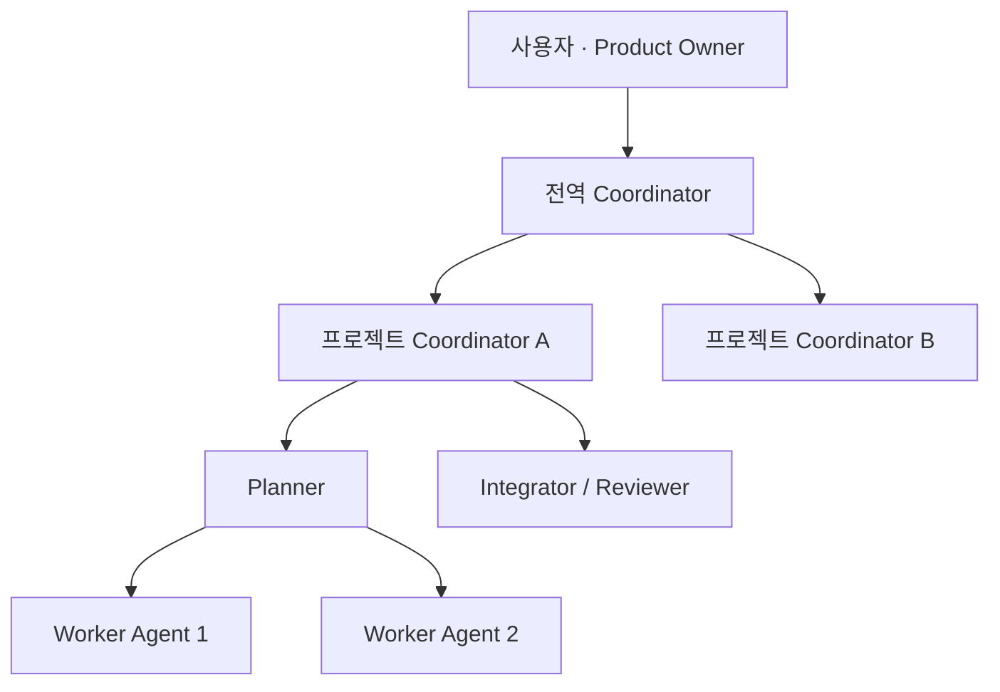
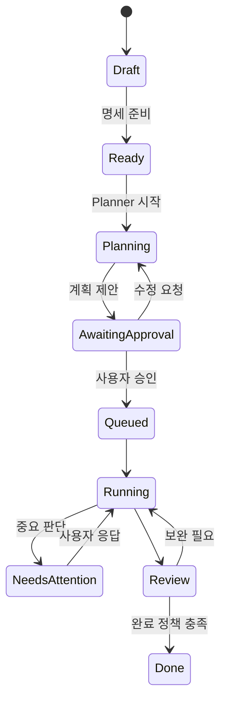
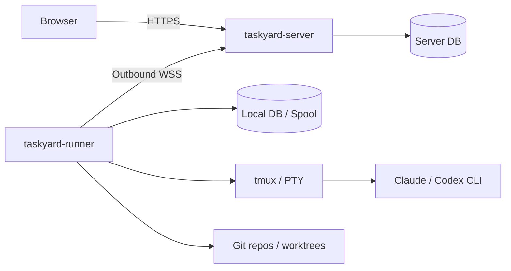

# Taskyard 제품 요구사항 문서(PRD)

> **제품 한 줄 정의:** 여러 프로젝트를 운영하는 1인 개발자가 AI 개발 조직을 지휘하는 작업 운영체제
>
> **태그라인:** Run your coding agents like a team.

| 항목 | 내용 |
|---|---|
| 문서 버전 | v1.0 Draft |
| 작성일 | 2026-08-21 |
| 1차 대상 | 여러 소프트웨어 프로젝트를 동시에 운영하는 1인 개발자 |
| 제품 형태 | 자체 호스팅 웹 서버 + 사용자 머신의 실행 러너 |
| 구현 언어 | Go 중심 |
| 핵심 제약 | 모델 API 비용 대신 사용자가 직접 로그인한 공식 Claude/Codex CLI 구독 사용 |
| 협업 기능 | MVP 제외, 다음 단계 |

---

## 1. 요약

Taskyard는 프로젝트별 티켓 보드를 중심으로, 티켓의 명세화·계획·작업 분할·병렬 실행·검토·통합을 여러 AI Agent에게 위임하는 개발 운영 도구다.

사용자는 아이디어를 티켓으로 만들고 `Ready` 상태로 옮긴다. AI Planner는 저장소와 프로젝트 맥락을 바탕으로 계획, 작업 분할 형태, 병렬화 방식, 브랜치 및 병합 전략을 제안한다. 사용자가 계획을 승인하면 여러 Worker Agent가 각자의 Git worktree에서 즉시 병렬 작업한다. 프로젝트별 Coordinator는 일상적인 판단과 Worker의 질문을 처리하고, 제품 방향·보안·비가역적 변경처럼 중요한 결정만 사용자에게 올린다. 모든 프로젝트 위에는 전역 Coordinator가 있어 프로젝트 간 우선순위와 자원 배분을 돕는다.

Taskyard는 자체 티켓 관리기를 기본 시스템 오브 레코드로 사용한다. GitHub Issues, Jira, Linear는 티켓의 외부 원천 또는 연결 대상으로 취급하며, 사용자는 외부 서비스 없이도 전체 흐름을 사용할 수 있어야 한다.

실행은 두 개의 Go 바이너리로 분리한다.

- `taskyard-server`: 웹 UI, 티켓, 계획, 정책, 스케줄링, 실행 상태, 알림 및 러너 관리를 담당한다.
- `taskyard-runner`: 사용자의 개발 머신에서 저장소, tmux/PTY, 공식 Claude/Codex CLI, Git worktree, 테스트 및 diff를 담당한다.

러너가 서버로 아웃바운드 연결하므로, 서버가 사용자의 소스코드나 Claude/Codex 인증정보를 직접 소유할 필요가 없다.

---

## 2. 문제 정의

### 2.1 사용자가 겪는 문제

여러 프로젝트를 운영하는 1인 개발자는 코딩 Agent를 사용할수록 직접 작성하는 코드의 양보다 다음 운영 비용이 커진다.

- 무엇을 먼저 시킬지 결정하고 맥락을 전달해야 한다.
- 큰 일을 독립적인 작업으로 나누고 여러 Agent에게 배정해야 한다.
- 여러 터미널과 tmux 세션을 오가며 질문, 승인, 실패를 확인해야 한다.
- 병렬 작업의 브랜치 충돌과 통합 순서를 관리해야 한다.
- Agent가 끝났다고 보고한 결과가 실제 완료조건을 만족하는지 검증해야 한다.
- 여러 프로젝트의 실행 상태와 중요한 판단 요청을 한눈에 보기 어렵다.
- 모델 API를 직접 사용하면 비용이 커져, 이미 결제 중인 Claude/Codex 구독을 활용하고 싶다.

기존 도구들은 이 문제의 일부만 해결한다.

- Jira, Linear, Kaneo류는 티켓을 관리하지만 AI 개발 조직의 계획·실행·통합을 책임지지 않는다.
- 터미널 및 Agent 실행 UI는 프로세스를 띄우지만 제품 요구사항에서 완료까지의 상태를 관리하지 않는다.
- GitHub는 코드와 PR을 관리하지만 여러 Agent의 판단 구조와 사용자 승인 흐름을 제공하지 않는다.

### 2.2 제품이 해결할 문제

Taskyard는 “티켓을 관리하는 곳”과 “Agent를 실행하는 곳” 사이의 단절을 없애야 한다. 사용자는 프로젝트 보드에서 제품 의도를 관리하고, Taskyard는 그 의도를 승인 가능한 실행 계획으로 바꾸고, 병렬 Agent 조직이 안전하게 결과를 만들도록 조율해야 한다.

---

## 3. 제품 비전과 포지셔닝

### 3.1 비전

한 명의 개발자가 여러 AI 개발팀을 운영하듯 여러 프로젝트를 동시에 전진시킬 수 있게 한다.

### 3.2 제품 카테고리

Taskyard는 다음 세 범주가 겹치는 지점에 있다.

- 내장형 티켓 및 프로젝트 관리기
- 로컬 AI 코딩 Agent 오케스트레이터
- Git/GitHub 기반 개발 실행 관제 도구

그러나 제품의 중심 정체성은 **AI 개발 조직 운영체제**다.

### 3.3 차별점

| 대안 | 잘하는 일 | Taskyard의 차이 |
|---|---|---|
| Jira·Linear·Kaneo | 티켓과 워크플로 관리 | 티켓을 Agent 계획·실행·통합의 원본으로 사용 |
| tmux·터미널 UI | 프로세스 실행과 관찰 | 티켓, 계획, 승인, 실행, 검토 상태를 하나로 연결 |
| GitHub Issues·Actions | 코드 협업과 자동화 | 대화형 Agent와 Coordinator의 판단 계층 제공 |
| 단일 코딩 Agent | 한 세션에서 구현 | 여러 프로젝트·여러 작업·여러 Agent를 병렬 운영 |

### 3.4 제품 원칙

1. **티켓이 출발점이다.** 모든 중요한 실행은 프로젝트와 티켓에 연결된다.
2. **계획 뒤 실행한다.** `Ready`는 즉시 코딩이 아니라 계획과 승인 요청을 시작한다.
3. **병렬화는 기본이다.** 독립 작업은 계획 승인 후 가능한 즉시 병렬 실행한다.
4. **AI는 구조를 추천하고 사용자가 책임 경계를 정한다.** 분할 형태와 병합 전략은 AI가 제안하되 승인 가능해야 한다.
5. **사용자의 주의력은 희소 자원이다.** Coordinator가 사소한 판단을 흡수하고 중요한 것만 올린다.
6. **터미널 출력보다 구조화된 상태가 우선이다.** 원시 터미널은 탈출구이며, 보드와 이벤트가 기본 인터페이스다.
7. **로컬 자산은 로컬에 둔다.** 소스코드와 CLI 인증정보는 원칙적으로 러너 머신을 벗어나지 않는다.
8. **구독 경계를 존중한다.** Taskyard가 인증정보를 대리 취급하지 않고 사용자가 공식 CLI에 직접 로그인한다.

---

## 4. 목표 사용자

### 4.1 1차 페르소나: 멀티 프로젝트 1인 개발자

특성:

- 제품, 오픈소스, 고객 프로젝트 등 여러 저장소를 동시에 운영한다.
- Git, GitHub, 터미널, tmux 사용에 익숙하다.
- Claude Code 또는 Codex CLI 구독을 이미 사용한다.
- 반복 구현은 Agent에게 위임하고 자신은 제품 판단과 검토에 집중하고 싶다.
- 별도의 DevOps 부담 없이 단일 바이너리 또는 간단한 컨테이너로 설치하고 싶다.

핵심 수행 과업(JTBD):

> 여러 프로젝트에 할 일이 쌓였을 때, 중요한 제품 결정을 잃지 않으면서 여러 Agent가 독립 작업을 병렬로 진행하게 하고, 내가 개입해야 하는 순간만 빠르게 처리하고 싶다.

### 4.2 2차 페르소나: 소규모 팀

팀 사용자, 권한, 담당자, 공유 승인, 감사로그 등은 다음 단계다. MVP의 데이터 모델은 향후 팀 확장을 막지 않아야 하지만, 초기 UI와 권한 모델을 복잡하게 만들지 않는다.

---

## 5. 목표와 비목표

### 5.1 MVP 목표

- 외부 티켓 도구 없이 여러 프로젝트의 티켓을 관리할 수 있다.
- 제목만으로 빠르게 티켓을 만들거나, AI 대화로 구현 가능한 명세를 만들 수 있다.
- `Ready` 티켓에서 AI가 계획·분할·병합 전략을 제안하고 사용자 승인을 요청한다.
- 승인된 독립 작업을 여러 Agent가 각자 격리된 worktree에서 병렬 수행한다.
- 프로젝트 Coordinator가 Worker의 일반 질문을 처리하고 중요한 판단만 사용자에게 요청한다.
- 사용자가 모든 프로젝트의 진행 상태와 개입 필요 항목을 웹 UI에서 파악할 수 있다.
- 사용자가 직접 로그인한 공식 Claude/Codex CLI를 러너에서 사용한다.
- 실행 로그, 변경 파일, diff, 테스트 결과, PR을 티켓에 연결한다.
- 서버와 러너의 연결이 일시적으로 끊겨도 실행 이벤트를 잃지 않고 복구한다.

### 5.2 MVP 비목표

- Jira의 전체 기능을 재현하는 것
- 스프린트, 간트차트, 타임 트래킹, 위키, 포트폴리오 회계
- 엔터프라이즈 수준의 복잡한 RBAC 및 워크플로 빌더
- 자체 LLM API 게이트웨이 또는 사용자 API 키 중계
- Claude/Codex 인증정보 수집, 복사, 서버 저장
- 범용 CI/CD 플랫폼 대체
- 자동 프로덕션 배포
- 모바일 앱
- 실시간 팀 협업 및 조직 관리

---

## 6. 핵심 개념과 AI 조직 구조



| 역할 | 책임 | 지속성 |
|---|---|---|
| 사용자 | 제품 방향, 중요한 승인, 최종 책임 | 영구 |
| 전역 Coordinator | 프로젝트 간 우선순위, 자원 충돌, 전체 Attention 요약 | 논리적으로 지속 |
| 프로젝트 Coordinator | 프로젝트 맥락 유지, Worker 질문 처리, 판단 에스컬레이션 | 프로젝트별로 지속 |
| Planner | 티켓 분석, 분할, 의존성, 실행·병합 전략 제안 | 계획 실행 단위 |
| Worker Agent | 할당된 작업 구현, 테스트, 결과 보고 | 작업 실행 단위 |
| Integrator/Reviewer | 병렬 결과 통합, 충돌 처리, 완료조건 검증 | 통합 실행 단위 |
| Runner | Agent 프로세스, 저장소와 로컬 도구 실행 | 머신 프로세스 |

Coordinator의 “지속성”은 CLI 프로세스를 영구 실행한다는 뜻이 아니다. Coordinator는 논리적 신원, 요약된 기억, 결정 기록, 프로젝트 정책을 가진다. 필요할 때 러너에서 새로운 Agent 실행을 시작하고 해당 기억을 다시 주입한다. 이는 구독 제한과 프로세스 복구에 유리하다.

### 6.1 핵심 도메인 객체

- **Workspace:** 사용자의 Taskyard 설치 단위
- **Project:** 저장소와 티켓 보드를 가진 제품 단위
- **Task:** 사용자 의도와 완료조건을 나타내는 티켓
- **Plan:** Task를 실행 가능한 구조로 바꾼 승인 대상 제안서
- **Work Item:** Plan이 만든 실행 또는 관리 단위
- **Run:** 특정 Agent가 특정 Work Item을 수행한 한 번의 실행
- **Agent Profile:** Claude/Codex, 역할, 권한, 프롬프트 정책 조합
- **Runner:** 저장소와 CLI를 실제로 실행하는 머신
- **Attention Item:** 사용자 판단이 필요한 질문, 승인, 실패 또는 위험
- **External Reference:** GitHub/Jira/Linear의 이슈·PR과 내부 Task의 연결

### 6.2 Task와 Run의 분리

Task와 Run은 반드시 다른 객체여야 한다.

- 하나의 Task는 계획, 구현, 재시도, 리뷰, 통합 등 여러 Run을 가질 수 있다.
- Run 실패는 Task 실패와 같지 않다.
- Task 상태는 제품 진행 상태를, Run 상태는 실행 프로세스 상태를 나타낸다.

---

## 7. 핵심 사용자 흐름

### 7.1 티켓 생성

사용자는 네 가지 진입 방식을 모두 사용할 수 있어야 한다.

1. 제목만 입력해 보드에 빠르게 카드 생성
2. 설명과 완료조건을 직접 작성
3. AI와 대화해 아이디어를 명세로 구체화
4. GitHub Issues, Jira 또는 Linear에서 가져오거나 연결

AI 명세화 모드는 다음 결과를 만들어야 한다.

- 명확한 제목
- 문제와 사용자 가치
- 범위와 비범위
- 완료조건
- 제약과 위험
- 확인이 필요한 질문
- 관련 저장소 및 코드 영역 후보

AI가 빈 내용을 임의로 확정하지 않도록, 사실·가정·미결정 사항을 구분한다.

### 7.2 Ready에서 계획 승인까지



`Ready`로 이동하면 Taskyard는 다음을 수행한다.

1. 저장소와 프로젝트 기억을 읽을 수 있는 러너를 선택한다.
2. Planner Run을 시작한다.
3. Planner가 작업 구조, 의존성, 위험, 검증 방법, 병합 전략을 제안한다.
4. 프로젝트 Coordinator가 계획의 누락과 프로젝트 정책 위반을 점검한다.
5. 사용자에게 승인 가능한 Plan을 보여준다.
6. 사용자가 승인, 수정 요청 또는 취소한다.

### 7.3 복잡도에 따른 분할 추천

AI는 티켓 복잡도에 따라 아래 형태 중 하나를 추천한다. 사용자는 승인 전에 바꿀 수 있다.

| 형태 | 적합한 경우 | 보드 표현 | 실행 방식 |
|---|---|---|---|
| 체크리스트 | 짧고 한 맥락에서 순차 처리 가능 | 부모 카드 내부 항목 | 보통 단일 Run |
| 하위 티켓 | 하나의 결과물 안에 구분되는 작업 | 부모-자식 카드 | 일부 병렬 가능 |
| 독립 연결 티켓 | 각각 독립 가치·수명·리뷰가 있음 | 별도 카드와 의존성 링크 | 독립 병렬 실행 |

추천 근거에는 예상 변경 범위, 의존성, 충돌 가능성, 검증 가능성, 각 작업의 독립적 완료 여부가 포함되어야 한다.

### 7.4 계획 승인 후 병렬 실행

계획이 승인되면 Taskyard는 의존성 그래프에서 실행 가능한 Work Item을 즉시 찾고, 사용 가능한 Agent/Runner 용량 안에서 병렬 실행한다.

- 각 구현 Work Item은 기본적으로 전용 Git branch와 worktree를 가진다.
- Worker는 자신에게 할당된 범위와 완료조건만 받는다.
- 공유 파일 충돌 가능성이 높은 작업은 Planner가 순차화하거나 통합 순서를 명시한다.
- 동시 실행 수는 Provider, Runner, Project 정책에 의해 제한된다.
- 구독 한도나 세션 제한이 감지되면 실행을 안전하게 일시정지하고 재개할 수 있어야 한다.

### 7.5 질문과 에스컬레이션

Worker의 질문은 먼저 프로젝트 Coordinator에게 간다.

Coordinator가 직접 처리할 수 있는 예:

- 기존 코드 패턴 중 무엇을 따를지
- 계획 범위 안의 소규모 구현 선택
- 테스트 위치와 명명 방식
- 이미 기록된 프로젝트 정책 확인

사용자에게 올려야 하는 예:

- 제품 동작이나 완료조건을 바꾸는 결정
- 데이터 손실 또는 비가역적 마이그레이션 위험
- 보안·개인정보·비용 영향
- 외부 계약 또는 API 변경
- 계획 범위를 크게 확대하는 발견
- Coordinator의 확신이 정책 임계값보다 낮은 판단

모든 Coordinator 답변은 결정 기록으로 남기고 관련 Task와 Run에 연결한다.

### 7.6 통합과 완료

Planner는 계획 단계에서 아래 전략 중 하나를 추천한다.

- 독립 PR 유지
- 의존 순서대로 연속 병합
- 통합 브랜치에 먼저 결합 후 단일 PR
- Integrator Agent가 병렬 브랜치를 재구성 또는 cherry-pick
- 충돌 위험 때문에 일부 작업을 순차 실행

통합 단계에서는 계획에 명시된 테스트, 정적 검사, 완료조건 검증을 실행한다. AI Reviewer가 결과를 요약하고 누락을 지적한다.

MVP의 기본 완료 정책은 다음과 같이 가정한다.

> 구현과 자동 검증이 성공하고 AI Review를 통과하면 `Ready for Review`가 된다. PR 병합 또는 사용자의 명시적 완료 승인이 확인되면 `Done`이 된다.

프로젝트 설정에서 자동 `Done`, 사용자 승인 필수, PR 병합 필수 중 선택 가능하도록 설계한다. 정확한 기본값은 사용자 검증 과정에서 확정한다.

---

## 8. 기능 요구사항

우선순위 표기:

- **P0:** MVP 필수
- **P1:** MVP 직후 필요
- **P2:** 후속 확장

### 8.1 프로젝트와 내장 티켓 관리

| ID | 요구사항 | 우선순위 |
|---|---|---|
| PM-01 | 프로젝트 생성 시 이름, 키, 설명, 기본 저장소, 기본 브랜치를 설정한다. | P0 |
| PM-02 | 첫 화면에서 프로젝트별 티켓 보드와 주요 상태를 본다. | P0 |
| PM-03 | 보드와 리스트 보기를 제공한다. | P0 |
| PM-04 | 제목만 입력해 카드를 즉시 만들 수 있다. | P0 |
| PM-05 | Markdown 설명과 구조화된 완료조건을 편집한다. | P0 |
| PM-06 | 상태, 우선순위, 라벨, 관련 Task, 부모·자식, 의존성을 관리한다. | P0 |
| PM-07 | 활동 타임라인에 사용자·AI·시스템의 변경을 기록한다. | P0 |
| PM-08 | 프로젝트 및 전체 범위에서 검색·필터링한다. | P1 |
| PM-09 | 기한, 마일스톤, 사용자 정의 필드를 제공한다. | P2 |

### 8.2 AI 대화 기반 명세화

| ID | 요구사항 | 우선순위 |
|---|---|---|
| SP-01 | Draft 티켓에서 “AI로 명세화” 대화를 시작한다. | P0 |
| SP-02 | AI는 한 번에 필요한 핵심 질문만 하고 답변을 티켓 구조에 반영한다. | P0 |
| SP-03 | AI가 제안한 변경사항을 diff 형태로 확인하고 적용·수정·거절한다. | P0 |
| SP-04 | 사실, 추론, 가정, 미결정 사항을 구분해 표시한다. | P0 |
| SP-05 | 대화가 끝나면 완료조건 누락과 실행 준비도를 점검한다. | P0 |
| SP-06 | 저장소 탐색을 통해 관련 코드 영역을 명세에 연결한다. | P1 |

### 8.3 계획과 승인

| ID | 요구사항 | 우선순위 |
|---|---|---|
| PL-01 | `Ready` 진입 시 Planner Run을 자동 생성한다. | P0 |
| PL-02 | Plan은 목표, 접근법, Work Item, 의존성, 파일·모듈 후보, 검증, 위험을 포함한다. | P0 |
| PL-03 | 체크리스트·하위 티켓·독립 티켓 중 분할 형태와 근거를 추천한다. | P0 |
| PL-04 | 병렬 실행 그래프와 예상 충돌 영역을 표시한다. | P0 |
| PL-05 | 브랜치, PR, 병합 및 Integrator 전략을 추천한다. | P0 |
| PL-06 | 사용자는 전체 승인, 수정 요청, 일부 Work Item 수정, 취소를 할 수 있다. | P0 |
| PL-07 | Plan 변경 이력과 승인자를 기록한다. | P0 |
| PL-08 | 사전 승인된 저위험 패턴은 프로젝트 정책에 따라 자동 승인한다. | P2 |

### 8.4 Coordinator와 기억

| ID | 요구사항 | 우선순위 |
|---|---|---|
| CO-01 | Workspace에 하나의 전역 Coordinator 논리 신원을 둔다. | P0 |
| CO-02 | 프로젝트마다 독립된 Coordinator 논리 신원과 기억을 둔다. | P0 |
| CO-03 | 프로젝트 기억은 기술 스택, 규칙, 아키텍처 결정, 반복 피드백, 금지사항을 포함한다. | P0 |
| CO-04 | Coordinator는 Worker 질문에 답하고 근거와 확신도를 기록한다. | P0 |
| CO-05 | 정책상 중요하거나 확신도가 낮은 질문은 Attention Item으로 전환한다. | P0 |
| CO-06 | 사용자의 답변을 해당 실행과 향후 프로젝트 기억에 반영할지 선택한다. | P0 |
| CO-07 | 전역 Coordinator는 모든 프로젝트의 진행, 병목, 구독·Runner 용량을 요약한다. | P1 |
| CO-08 | 기억 항목은 출처, 생성 시점, 적용 범위, 폐기 상태를 가진다. | P1 |

### 8.5 스케줄링과 병렬 Agent 실행

| ID | 요구사항 | 우선순위 |
|---|---|---|
| EX-01 | 승인된 Plan의 의존성 DAG를 계산해 실행 가능한 Work Item을 찾는다. | P0 |
| EX-02 | 독립 Work Item을 설정된 동시성 한도까지 즉시 병렬 실행한다. | P0 |
| EX-03 | Agent Profile, 저장소 접근성, Runner 상태, Provider 용량으로 배치한다. | P0 |
| EX-04 | 각 Run에 고유 ID, 명령 ID, 재시도 횟수, 이벤트 순서를 부여한다. | P0 |
| EX-05 | 취소, 일시정지, 재개, 실패 후 재시도를 지원한다. | P0 |
| EX-06 | 구독 한도·로그인 만료·승인 대기를 구분해 표시한다. | P0 |
| EX-07 | Provider 자동 전환은 명시적으로 승인된 정책이 있을 때만 수행한다. | P0 |
| EX-08 | 예상 충돌도가 높은 Work Item을 경고하거나 순차화한다. | P1 |

### 8.6 실행 관찰과 터미널 제어

| ID | 요구사항 | 우선순위 |
|---|---|---|
| RU-01 | Run의 구조화된 이벤트, 현재 단계, 경과시간, 마지막 활동을 표시한다. | P0 |
| RU-02 | 필요할 때 xterm.js 기반 터미널에 연결해 직접 관찰·입력한다. | P0 |
| RU-03 | 터미널 접속과 사용자 입력을 감사 이벤트로 남긴다. | P0 |
| RU-04 | tmux 세션이 웹 연결과 독립적으로 유지된다. | P0 |
| RU-05 | Runner 재시작 후 기존 세션과 Run을 재발견하고 상태를 조정한다. | P0 |
| RU-06 | 긴 원시 로그는 Runner에 보관하고 Server에는 구조화 이벤트와 제한된 출력만 보낸다. | P1 |

### 8.7 Git, worktree와 GitHub

| ID | 요구사항 | 우선순위 |
|---|---|---|
| GH-01 | 프로젝트 저장소의 경로, 원격, 기본 브랜치를 검증한다. | P0 |
| GH-02 | 구현 Work Item별 branch와 worktree를 생성한다. | P0 |
| GH-03 | 변경 파일, diff 요약, 커밋, 테스트 결과를 Run에 연결한다. | P0 |
| GH-04 | 실행 취소 시 미커밋 변경을 보존하고 정리 여부를 사용자에게 묻는다. | P0 |
| GH-05 | 사용자의 기존 `git` 및 `gh` 로그인을 이용해 branch push와 PR 생성을 지원한다. | P0 |
| GH-06 | PR 상태와 병합 여부를 Task에 반영한다. | P1 |
| GH-07 | GitHub Issues를 내부 Task에 링크하거나 가져온다. | P1 |
| GH-08 | GitHub App과 webhook 기반 양방향 상태 동기화를 지원한다. | P2 |

### 8.8 Attention과 검토

| ID | 요구사항 | 우선순위 |
|---|---|---|
| AT-01 | 전 프로젝트의 사용자 개입 필요 항목을 하나의 Inbox에 모은다. | P0 |
| AT-02 | 항목을 계획 승인, 질문, 권한 승인, 실패, 충돌, 리뷰로 분류한다. | P0 |
| AT-03 | 각 항목은 영향, 긴급도, 추천안, 응답하지 않을 때의 동작을 보여준다. | P0 |
| AT-04 | 사용자는 Inbox에서 답변·승인 후 원래 Task로 돌아가지 않아도 된다. | P0 |
| AT-05 | AI Review는 완료조건별 증거, 테스트, 미해결 위험을 요약한다. | P0 |
| AT-06 | 알림 채널 연동을 지원한다. | P2 |

### 8.9 외부 티켓 연동

내부 Task가 항상 정규화된 원본 모델이다. 외부 시스템의 필드를 내부 스키마 전체에 침투시키지 않고 `External Reference`와 동기화 정책으로 분리한다.

| 모드 | 동작 | 우선순위 |
|---|---|---|
| 링크 | 외부 URL과 ID를 내부 Task에 연결 | P1 |
| 가져오기 | 외부 이슈를 내부 Task로 복제하고 출처 유지 | P1 |
| 수동 갱신 | 사용자가 요청할 때 제목·설명·상태 차이를 비교 | P1 |
| 양방향 동기화 | 필드 매핑 및 충돌 정책에 따라 자동 동기화 | P2 |

연동 순서는 GitHub Issues, Linear, Jira를 기본 가정으로 한다. 실제 우선순위는 초기 사용자 검증에서 조정한다.

### 8.10 Runner 관리

| ID | 요구사항 | 우선순위 |
|---|---|---|
| RN-01 | 일회성 페어링 코드로 Runner를 등록한다. | P0 |
| RN-02 | Runner의 OS, 도구 버전, Provider 로그인 상태, 저장소 목록, 가용성을 표시한다. | P0 |
| RN-03 | 프로젝트별 허용 Runner와 저장소 경로를 지정한다. | P0 |
| RN-04 | Heartbeat로 online, busy, degraded, offline을 판정한다. | P0 |
| RN-05 | Runner가 offline이어도 로컬 Run과 이벤트를 보존하고 재연결 시 재전송한다. | P0 |
| RN-06 | 태그와 역량으로 Runner를 선택한다. | P1 |

---

## 9. 상태 모델

### 9.1 Task 상태

보드가 지나치게 많은 열로 복잡해지지 않도록, 사용자 중심 상태와 실행 세부 상태를 분리한다.

권장 기본 보드 열:

- `Backlog`
- `Draft`
- `Ready`
- `In Progress`
- `Review`
- `Done`

카드 배지로 표시할 실행 세부 상태:

- Planning
- Awaiting Plan Approval
- Queued
- Running
- Needs Attention
- Integrating
- Failed
- Paused

### 9.2 Plan 상태

- `draft`
- `reviewing`
- `changes_requested`
- `approved`
- `superseded`
- `cancelled`

### 9.3 Run 상태

- `pending`
- `assigned`
- `starting`
- `running`
- `waiting_approval`
- `waiting_input`
- `paused_quota`
- `paused_user`
- `succeeded`
- `failed`
- `cancelled`
- `orphaned`

### 9.4 Runner 상태

- `online`
- `busy`
- `degraded`
- `offline`
- `revoked`

---

## 10. 정보 구조와 주요 화면

### 10.1 전역 내비게이션

- **Projects:** 프로젝트별 티켓 보드와 요약
- **Attention:** 모든 프로젝트의 사용자 개입 항목
- **Runs:** 현재 및 과거 실행
- **Runners:** 머신, Provider 로그인, 용량 상태
- **Settings:** Agent, 정책, 연동, 보안

### 10.2 홈: 프로젝트별 티켓 보드

Taskyard를 열면 프로젝트별 보드를 가장 먼저 보여준다.

필수 요소:

- 프로젝트 전환기와 전체 포트폴리오 요약
- 상태별 카드
- 빠른 티켓 입력
- Running Agent 수, Attention 수, 실패 수
- 카드에서 현재 실행 단계와 Agent 표시
- 필터: 상태, 우선순위, 라벨, Agent, Attention 여부

여러 프로젝트를 한 화면에 보여줄 때는 모든 칸반을 펼치기보다, 프로젝트별 요약 보드와 사용자가 고정한 주요 프로젝트 보드를 조합한다.

### 10.3 프로젝트 화면

탭:

- `Board`
- `List`
- `Attention`
- `Runs`
- `Pull Requests`
- `Memory`
- `Settings`

### 10.4 Task 상세

탭:

- `Overview`: 설명, 완료조건, 관계, 외부 링크
- `Plan`: 제안 계획, 분할, DAG, 승인
- `Runs`: Agent별 상태와 터미널
- `Changes`: branch, commit, diff, 테스트, PR
- `Activity`: 결정과 이벤트 타임라인

핵심 행동:

- AI로 명세화
- Ready로 이동
- 계획 승인 또는 수정 요청
- 실행 일시정지·재개·취소
- Coordinator에게 질문
- 결과 리뷰 및 완료

### 10.5 Run 상세

- 역할, Provider, Agent Profile, Runner
- 할당된 범위와 완료조건
- 구조화된 진행 이벤트
- 실시간 또는 재생 가능한 터미널
- 도구 호출 및 승인 요청
- 변경 파일과 diff
- 테스트 결과
- 질문 및 Coordinator 답변
- 비용 대신 구독 사용 상태와 세션 상태

---

## 11. 기술 아키텍처

### 11.1 배포 구조



### 11.2 `taskyard-server` 책임

- 웹 UI와 HTTP API
- Workspace, Project, Task, Plan, Work Item 데이터
- 사용자 승인과 Attention Inbox
- 결정론적 스케줄러와 상태 전이
- Runner 등록, heartbeat, capability registry
- 명령 발행과 이벤트 수집
- 프로젝트 및 Coordinator 기억 저장
- GitHub/Jira/Linear 메타데이터 연동
- 감사로그와 정책 평가

서버는 AI의 인지 작업을 직접 API 호출로 수행하지 않는다. Planner와 Coordinator의 AI 추론도 선택된 Runner에서 구독 CLI Run으로 실행한다. 서버는 상태, 정책, 명령, 결과를 조율한다.

### 11.3 `taskyard-runner` 책임

- 서버로 아웃바운드 WebSocket 연결
- 로컬 저장소 탐색과 허용 경로 검증
- tmux 세션 및 PTY 생성·재연결
- Claude Code 및 Codex CLI 실행 어댑터
- Git branch/worktree 생성과 정리
- 명령 실행, 테스트, diff와 상태 수집
- 구조화 이벤트, hook, 출력 파싱
- 연결 단절 중 이벤트 spool과 재전송
- 로컬 인증 상태 감지하되 인증 비밀은 읽거나 전송하지 않음

### 11.4 Go 프로젝트 구조 제안

하나의 Go 모노레포에서 두 바이너리를 빌드한다.

```text
cmd/
  taskyard-server/
  taskyard-runner/
internal/
  server/
  runner/
  domain/
  protocol/
  scheduler/
  agents/
  gitops/
  security/
web/
  templates/
  static/
```

권장 초기 구성:

- Go `net/http` 또는 가벼운 라우터
- 서버 렌더링 템플릿 + HTMX/Alpine.js
- 터미널에 xterm.js
- 정적 자산은 `embed.FS`로 바이너리에 포함
- Server DB는 SQLite, 향후 PostgreSQL 선택 지원
- Runner 상태와 spool은 로컬 SQLite
- PTY는 검증된 Go PTY 라이브러리, 세션 지속은 tmux 사용
- GitHub 작업은 사용자의 `git` 및 `gh` CLI 우선

### 11.5 프로토콜 요구사항

Server와 Runner 간 프로토콜은 버전이 명시된 구조화 메시지를 사용한다.

명령 예:

- `run.start`
- `run.pause`
- `run.resume`
- `run.cancel`
- `terminal.attach`
- `terminal.input`
- `repo.inspect`
- `git.diff`
- `runner.configure`

이벤트 예:

- `run.state_changed`
- `agent.message`
- `agent.question`
- `approval.requested`
- `tool.started`
- `tool.finished`
- `git.changed`
- `test.finished`
- `terminal.output`
- `runner.heartbeat`

필수 신뢰성 특성:

- 모든 명령은 고유 `command_id`를 가진다.
- Runner는 같은 명령을 중복 수신해도 한 번만 적용한다.
- 각 Run 이벤트는 단조 증가하는 `sequence`를 가진다.
- Server는 마지막 수신 sequence를 ACK한다.
- Runner는 미수신 이벤트를 로컬 spool에서 재전송한다.
- Server와 Runner는 프로토콜 버전과 capability를 연결 시 협상한다.
- heartbeat 누락만으로 실행을 즉시 실패 처리하지 않고 `orphaned` 조정 절차를 거친다.

### 11.6 Agent 어댑터

공통 인터페이스는 다음 역량 차이를 흡수해야 한다.

- 시작, 재개, 중단, 취소
- 구조화 이벤트 또는 hook 수신
- 사용자/Coordinator 메시지 전달
- 승인 요청 수신과 응답
- 세션 식별자 저장
- 구독 한도, 로그인 만료, CLI 오류 구분
- 최종 결과와 사용 통계 수집

어댑터 우선순위:

1. Codex의 공식 구조화 인터페이스가 제공하는 이벤트와 승인 흐름 활용
2. Claude Code의 공식 CLI 및 hook 활용
3. 모든 Agent에 대한 tmux/PTY 터미널 fallback

구조화 이벤트를 정본으로 사용하고, 터미널 파싱은 최후 수단으로 제한한다.

---

## 12. 데이터 모델 초안

| 엔터티 | 핵심 필드 |
|---|---|
| Workspace | id, name, policies, global_coordinator_id |
| Project | id, key, name, description, default_repo_id, coordinator_id, settings |
| Repository | id, project_id, runner_id, local_path, remote_url, default_branch |
| Task | id, project_id, number, title, description, acceptance_criteria, status, priority, parent_id |
| TaskRelation | source_task_id, target_task_id, type |
| Plan | id, task_id, version, status, summary, merge_strategy, risk_summary |
| WorkItem | id, plan_id, task_id, type, scope, status, parallel_group |
| Dependency | predecessor_work_item_id, successor_work_item_id, type |
| Run | id, work_item_id, agent_profile_id, runner_id, state, session_ref, branch, worktree_path |
| RunEvent | run_id, sequence, type, payload, occurred_at |
| AgentProfile | id, provider, role, model_or_mode, permissions, prompt_policy |
| CoordinatorMemory | id, scope_type, scope_id, kind, content, source_ref, confidence, status |
| Decision | id, project_id, task_id, run_id, actor, question, answer, rationale, importance |
| AttentionItem | id, project_id, task_id, run_id, type, severity, status, recommendation |
| Runner | id, name, status, capabilities, last_seen_at, revoked_at |
| ExternalReference | id, task_id, provider, external_id, url, sync_mode, sync_cursor |
| GitArtifact | id, run_id, type, ref, url, metadata |

### 12.1 이벤트와 감사

사용자 승인, Coordinator 결정, Agent 권한 승인, 터미널 직접 입력, 상태 강제 변경, Runner 등록·해지는 append-only 감사 이벤트로 남긴다. 대용량 터미널 원문은 별도 보존 정책을 적용한다.

---

## 13. 인증, 구독 및 비용 경계

### 13.1 기본 정책

- 사용자가 Runner 머신에서 공식 Claude/Codex CLI에 직접 로그인한다.
- Taskyard는 로그인 페이지를 흉내 내거나 OAuth 토큰을 중계하지 않는다.
- Taskyard는 CLI 인증 파일, 쿠키, refresh token을 읽거나 복사하지 않는다.
- Server는 Provider 인증 비밀을 저장하지 않는다.
- Runner는 “사용 가능, 로그인 필요, 구독 제한, 오류” 같은 상태만 Server에 보고한다.

### 13.2 API 비용 방지

기본 실행 환경에서는 다음과 같은 API 과금용 환경변수가 발견될 경우 경고하거나 Agent에 전달하지 않는다.

- `OPENAI_API_KEY`
- `CODEX_API_KEY`
- `ANTHROPIC_API_KEY`
- `ANTHROPIC_AUTH_TOKEN`

사용자가 프로젝트 정책에서 API 모드를 명시적으로 활성화한 경우에만 예외를 허용한다. MVP에서는 API 모드 자체를 제공하지 않아도 된다.

### 13.3 상용화 전 확인 사항

공식 CLI 자동화와 구독 사용 조건은 Provider별로 다를 수 있고 변경될 수 있다. 특히 제3자 제품이 구독 인증을 대리하거나 토큰을 재사용하는 방식은 피한다. 상용 배포 전 각 Provider의 최신 약관과 자동화 허용 범위를 검토하고, 필요하면 서면 승인을 확보한다.

---

## 14. 보안과 개인정보

### 14.1 위협 모델

주요 위험:

- Server 탈취 후 Runner에 임의 명령 실행
- Runner 토큰 유출 또는 가짜 Runner 등록
- Agent의 프롬프트 인젝션으로 위험한 명령 실행
- 저장소 경계를 벗어난 파일 접근
- 웹 터미널을 통한 권한 오용
- 로그와 diff에 포함된 비밀의 Server 전송
- worktree 및 프로세스 정리 중 사용자 변경 손실

### 14.2 필수 통제

- Runner는 Server로만 아웃바운드 TLS/WSS 연결
- 일회성 페어링 코드와 취소 가능한 Runner 자격증명
- 명령 ID, nonce, 만료시간 및 재생 방지
- 프로젝트별 허용 저장소 경로
- Agent Profile별 도구 및 명령 권한
- 위험 명령과 외부 부작용에 대한 승인 게이트
- 터미널 직접 입력 감사
- 비밀 패턴 redaction 후 로그 전송
- worktree 삭제 전 변경사항 검증과 보존
- Server UI의 CSRF, 세션 보안, origin 검증
- Runner와 프로토콜 자동 업데이트는 서명 검증 후 수행

### 14.3 데이터 배치 원칙

Server에 저장:

- 티켓, 계획, 결정, 구조화 이벤트
- 제한된 로그와 diff 요약
- Git commit 및 PR 메타데이터

Runner에 저장:

- 저장소 원본과 worktree
- Provider CLI 인증정보
- 대용량 원시 터미널 로그
- 연결 단절 중 이벤트 spool

프로젝트 설정에서 diff와 로그의 Server 전송 수준을 조정할 수 있어야 한다.

---

## 15. 비기능 요구사항

### 15.1 설치와 운영

- Server와 Runner는 각각 단일 Go 바이너리로 배포 가능해야 한다.
- Server는 SQLite를 사용해 별도 DB 없이 시작할 수 있어야 한다.
- 정적 웹 자산과 DB migration을 바이너리에 포함한다.
- 컨테이너 배포와 systemd 실행 예제를 제공한다.
- Runner는 macOS와 Linux를 우선 지원한다.
- 버전 불일치 시 호환 여부와 업그레이드 방법을 명확히 표시한다.

### 15.2 성능 목표

- 1,000개 Task 규모의 프로젝트 보드 초기 로드: 로컬 네트워크 기준 2초 이내
- Runner 명령 전달: 정상 연결 시 p95 1초 이내
- 구조화 실행 이벤트 UI 반영: p95 2초 이내
- 10개 동시 Run의 이벤트 스트림을 단일 Server에서 안정적으로 처리
- 재연결 후 10,000개 spool 이벤트를 유실·중복 적용 없이 복구

수치는 MVP 검증용 초기 목표이며 실제 측정 후 조정한다.

### 15.3 신뢰성

- Server 재시작이 tmux의 실행 프로세스를 종료하지 않아야 한다.
- Runner 재시작 후 살아 있는 세션을 재발견해야 한다.
- 동일 명령 재전송이 branch, worktree, Run을 중복 생성하지 않아야 한다.
- 이벤트는 at-least-once 전송하되 Server에서 멱등 적용한다.
- 상태 불일치는 자동 reconciliation 또는 사용자에게 명확한 복구 선택지를 제공한다.

### 15.4 접근성과 사용성

- 키보드만으로 보드 탐색, 티켓 생성, 승인 처리 가능
- 상태는 색상만으로 구분하지 않음
- 터미널과 로그에 검색, 일시정지, 복사 제공
- 사용자의 주의를 요구하는 행동은 이유와 영향 범위를 함께 표시

---

## 16. MVP 출시 범위

### 16.1 P0 기능 묶음

1. **내장 티켓 보드**
   - 여러 프로젝트
   - 빠른 카드 생성
   - 설명, 완료조건, 상태, 우선순위, 라벨, 관계

2. **AI 명세와 계획**
   - 대화 기반 명세화
   - Ready → Planner → Plan 승인
   - 복잡도 기반 분할 및 병합 전략 추천

3. **두 바이너리 실행 기반**
   - Server/Runner 페어링
   - 아웃바운드 WSS
   - heartbeat, 명령, 이벤트, spool, 복구

4. **Claude/Codex 실행**
   - 공식 CLI의 사용자 로그인 사용
   - tmux/PTY 세션
   - 구조화 이벤트 또는 hook
   - 터미널 fallback

5. **병렬 개발 실행**
   - 의존성 DAG
   - Agent별 worktree와 branch
   - 즉시 병렬 스케줄링
   - 일시정지, 재개, 취소, 재시도

6. **Coordinator와 Attention**
   - 프로젝트별 기억
   - Worker 질문 중재
   - 중요 판단 Inbox
   - 사용자 답변의 실행 재개

7. **검토와 GitHub 결과**
   - diff, test, commit
   - `gh`를 이용한 PR 생성
   - AI Review와 사용자 완료 승인

### 16.2 MVP에서 의도적으로 미루는 기능

- Jira·Linear 양방향 동기화
- GitHub App 기반 고급 연동
- 자동 Provider 전환
- 팀, 초대, 역할, 담당자, 공유 승인
- Slack/이메일/모바일 알림
- 원격 sandbox Runner 제공
- 사용량 예측과 고급 포트폴리오 최적화

---

## 17. MVP 수용 기준

다음 시나리오가 처음부터 끝까지 성공하면 MVP 핵심이 성립한다.

### 시나리오 A: 아이디어에서 병렬 PR까지

1. 사용자가 새 프로젝트를 만들고 로컬 저장소가 있는 Runner를 연결한다.
2. 제목만으로 티켓을 만든다.
3. AI와 대화해 설명과 검증 가능한 완료조건을 만든다.
4. 티켓을 Ready로 옮긴다.
5. AI가 최소 2개의 독립 작업, 의존성, worktree, 병합 전략을 제안한다.
6. 사용자가 계획을 승인한다.
7. 두 Worker가 별도 worktree에서 동시에 실행된다.
8. 한 Worker의 일반 질문은 Coordinator가 답하고 작업이 계속된다.
9. 중요한 제품 판단은 사용자의 Attention Inbox에 표시된다.
10. 사용자 답변 후 해당 Run이 맥락을 유지한 채 재개된다.
11. 모든 작업의 테스트와 완료조건 증거를 확인한다.
12. 계획된 전략으로 결과를 통합하고 GitHub PR을 만든다.
13. 사용자 승인 또는 PR 병합 후 티켓이 Done이 된다.

### 시나리오 B: 연결 장애 복구

1. Run 실행 중 Server와 Runner 연결을 끊는다.
2. tmux의 Agent 작업은 가능한 범위에서 계속된다.
3. Runner가 이벤트를 로컬에 보존한다.
4. 연결 복구 후 이벤트가 순서대로 동기화된다.
5. 중복 명령이나 중복 worktree 없이 Server 상태가 실제 상태와 일치한다.

### 시나리오 C: 구독 인증 경계

1. 사용자가 Runner에서 공식 CLI에 직접 로그인한다.
2. Taskyard는 로그인 가능 상태만 표시한다.
3. Server DB와 네트워크 이벤트에 Provider 인증 비밀이 포함되지 않는다.
4. API 키 환경변수가 있을 때 기본적으로 사용하지 않고 사용자에게 경고한다.

---

## 18. 성공 지표

### 18.1 북극성 지표

**주당 사용자 승인 후 완료된 Agent Work Item 수**

단순 Agent 실행 수가 아니라, 계획 승인과 완료조건 검증을 거쳐 실제 프로젝트 진척으로 연결된 양을 측정한다.

### 18.2 핵심 지표

| 영역 | 지표 |
|---|---|
| 활성화 | 첫 프로젝트 생성부터 첫 성공 Run까지 걸린 시간 |
| 명세 | Draft 중 실행 가능한 완료조건을 갖추고 Ready로 이동한 비율 |
| 계획 | 첫 제안으로 승인된 Plan 비율, 수정 횟수 |
| 병렬화 | 승인 Plan당 동시 실행 Work Item 수, 순차 대비 리드타임 감소 |
| 자율성 | Worker 질문 중 Coordinator가 사용자 개입 없이 처리한 비율 |
| 주의력 | Attention Item 수, 응답 시간, 불필요하다고 표시된 비율 |
| 품질 | 첫 Review 통과율, 재작업률, 병합 후 회귀율 |
| 신뢰성 | Run 복구 성공률, 이벤트 유실률, orphaned Run 비율 |
| 유지 | 주간 활성 프로젝트 수, 주간 완료 Task 수 |

성공을 위해 자율성 비율만 높이지 않는다. 잘못된 자율 판단은 에스컬레이션보다 비용이 크므로 품질·재작업 지표와 함께 본다.

---

## 19. 주요 위험과 대응

| 위험 | 영향 | 대응 |
|---|---|---|
| 공식 CLI 자동화 또는 구독 조건 변경 | 핵심 실행 방식 제약 | 인증 비밀 비취급, 공식 인터페이스 우선, Provider별 어댑터, 상용화 전 약관 확인 |
| tmux 화면 파싱의 취약성 | 상태 오판·승인 누락 | 구조화 이벤트/hook 우선, 터미널은 fallback |
| 병렬 작업의 Git 충돌 | 통합 비용 증가 | Planner 충돌 예측, worktree 격리, 병합 전략 사전 승인, Integrator 역할 |
| Coordinator의 잘못된 판단 | 제품 품질·보안 문제 | 중요도 정책, 확신도 임계값, 결정 기록, 사용자 수정의 기억 반영 |
| Server 탈취로 Runner 악용 | 로컬 코드와 머신 위험 | 최소 권한, 경로 allowlist, 위험 명령 승인, 자격증명 취소, 감사로그 |
| 구독 한도와 동시성 불확실성 | 실행 정지와 UX 저하 | Provider/Runner별 동시성 정책, 한도 상태 구분, 안전한 일시정지·재개 |
| 너무 많은 상태와 화면 | 1인 사용자의 인지 부담 | 보드 상태 단순화, 세부 상태는 배지, Attention 중심 UI |
| 내장 티켓 기능 범위 팽창 | 핵심 Agent 기능 지연 | MVP 필드를 제한하고 스프린트·간트·고급 필드는 후순위 |
| 원시 로그의 데이터 유출 | 비밀 노출 | 로컬 우선 보관, redaction, 전송 수준 설정 |

---

## 20. 단계별 로드맵

### Phase 0 — 내부 Dogfood

- Go 모노레포와 두 바이너리
- 단일 사용자·단일 Server·복수 Runner 기반
- 프로젝트, 기본 보드, Task 상세
- 한 Provider의 CLI Run과 tmux 재연결
- 수동 worktree와 실행 이벤트

### Phase 1 — Solo Developer MVP

- Claude와 Codex 어댑터
- AI 명세화와 계획 승인
- 분할 추천, DAG, 병렬 Worker
- 프로젝트 Coordinator와 Attention Inbox
- Git diff, 테스트, PR, AI Review
- 연결 단절 복구와 보안 기본선

### Phase 1.5 — 연동과 운영성

- GitHub Issues 가져오기·링크
- Linear와 Jira 링크·가져오기
- 전역 Coordinator 요약
- Runner 역량 태그와 고급 스케줄링
- 설치, 백업, 업그레이드 개선

### Phase 2 — 팀

- 사용자, 조직, 프로젝트 멤버
- 역할과 권한
- 담당자와 공유 Attention
- 계획 및 병합의 다중 승인
- 댓글·멘션·알림
- 팀 감사로그와 정책 템플릿

### Phase 3 — 플랫폼

- 플러그인형 Agent/Provider 어댑터
- 원격 격리 Runner
- Jira·Linear·GitHub 양방향 동기화
- 조직 수준 포트폴리오 최적화
- 정책 기반 저위험 자동 승인

---

## 21. 제품 결정 기록

### 확정된 결정

| 주제 | 결정 |
|---|---|
| 제품명 | Taskyard |
| 첫 화면 | 프로젝트별 티켓 보드 |
| 티켓 시스템 | 내장 관리기가 기본, Jira·Linear·GitHub 연동 가능 |
| 티켓 생성 | 빠른 카드, 직접 명세, AI 대화, 외부 가져오기 모두 지원 |
| Ready 동작 | AI가 먼저 계획·분할 후 사용자 승인 요청 |
| 분할 표현 | 복잡도에 따라 AI가 체크리스트·하위 티켓·독립 티켓 추천 |
| 실행 | 승인 후 독립 작업을 여러 Agent가 즉시 병렬 수행 |
| 병합 | 계획 단계에서 AI가 방법 추천 |
| Worker 질문 | 프로젝트 Coordinator가 처리하고 중요한 것만 사용자에게 질문 |
| Coordinator | 전역 Coordinator 아래 프로젝트별 Coordinator |
| 1차 사용자 | 여러 프로젝트를 운영하는 1인 개발자 |
| 팀 기능 | 다음 단계 |
| 구현 언어 | 배포 편의를 위해 Go |
| 프로세스 구조 | 처음부터 Server와 Runner 두 바이너리 |
| 모델 이용 | API 키보다 공식 CLI 구독 사용 우선 |

### 미확정 또는 검증이 필요한 결정

| 주제 | 현재 가정 | 검증 방법 |
|---|---|---|
| Done 게이트 | 검증+AI Review 후 Review, PR 병합 또는 사용자 승인 후 Done | 초기 사용자 인터뷰와 Dogfood |
| 첫 외부 티켓 연동 | GitHub Issues 우선 | 실제 사용 빈도 조사 |
| Server DB | SQLite 우선, PostgreSQL 후속 | 프로젝트·이벤트 규모 측정 |
| 웹 UI | 서버 렌더링+HTMX 중심 | 복잡한 실시간 UI 구현성 검증 |
| 기본 Runner 배치 | 사용자 개발 머신 한 대 | 다중 머신 사용 패턴 관찰 |
| Agent 선택 정책 | Plan에서 역할별 추천, 사용자 정책 우선 | 품질·한도·재시도 데이터 측정 |
| Coordinator 기억 압축 | 출처 있는 구조화 기억+필요 시 대화 요약 | 장기 프로젝트에서 맥락 손실 평가 |
| 자동 승인 범위 | MVP에서는 계획과 중요 결정에 사용자 승인 | Attention 피로도 측정 후 확대 |
| 브랜드 | Taskyard 이름과 태그라인 사용 | 상표·도메인·패키지명 확인 |

---

## 22. 출시 전 반드시 답할 질문

1. 기본 `Done` 정책은 PR 병합 필수인가, 사용자 승인만으로 가능한가?
2. Taskyard가 처음 지원할 Claude/Codex CLI 버전과 공식 자동화 표면은 무엇인가?
3. Planner, Coordinator, Worker별 기본 Agent 선택은 어떻게 할 것인가?
4. 사용자에게 올라갈 “중요한 판단”의 초기 규칙과 확신도 임계값은 무엇인가?
5. 로그·diff의 Server 전송 기본값은 어느 수준이어야 하는가?
6. Runner가 실행할 수 있는 명령과 경로의 기본 허용 정책은 무엇인가?
7. worktree 정리와 실패 Run 보존 기간은 얼마인가?
8. GitHub Issues, Linear, Jira 중 실제 첫 연동 수요는 무엇인가?
9. 전역 Coordinator가 자동으로 프로젝트 우선순위를 바꿀 수 있는가, 추천만 하는가?
10. 상용 제공 전에 각 Provider와 확인해야 할 구독·자동화 정책은 무엇인가?

---

## 23. 용어집

| 용어 | 정의 |
|---|---|
| Task | 사용자의 제품 의도와 완료조건을 담은 내부 티켓 |
| Plan | Task를 어떤 구조와 순서로 실행할지에 대한 승인 대상 제안 |
| Work Item | Plan을 구성하는 체크리스트, 하위 티켓 또는 독립 실행 단위 |
| Run | Agent가 Work Item을 수행한 한 번의 실행 |
| Coordinator | 맥락과 정책을 이용해 계획을 점검하고 Worker 판단을 중재하는 AI 역할 |
| Planner | Task를 분석하고 실행 구조와 병합 전략을 만드는 AI 역할 |
| Worker | 할당된 범위를 구현하고 검증하는 AI 역할 |
| Integrator | 여러 Worker 결과를 계획된 방식으로 결합하는 역할 |
| Runner | 로컬에서 CLI, Git, 테스트를 실행하는 Taskyard 바이너리 |
| Attention | 사용자 판단이나 승인이 있어야 진행할 수 있는 항목 |
| Project Memory | 프로젝트의 규칙, 결정, 피드백, 아키텍처 맥락을 출처와 함께 보존한 기억 |

---

## 24. 최종 제품 정의

Taskyard는 보드에서 티켓을 정리하는 도구에 머물지 않는다. 티켓을 제품 의도의 원본으로 삼고, AI가 실행 구조를 제안하며, 사용자가 책임 경계를 승인하고, 여러 Agent가 로컬 개발 환경에서 병렬로 결과를 만드는 전 과정을 운영한다.

MVP가 성공했을 때 사용자는 여러 tmux 창을 감시하는 사람이 아니라, 프로젝트별 AI 개발팀의 중요한 결정과 결과를 관리하는 Product Owner가 된다.
